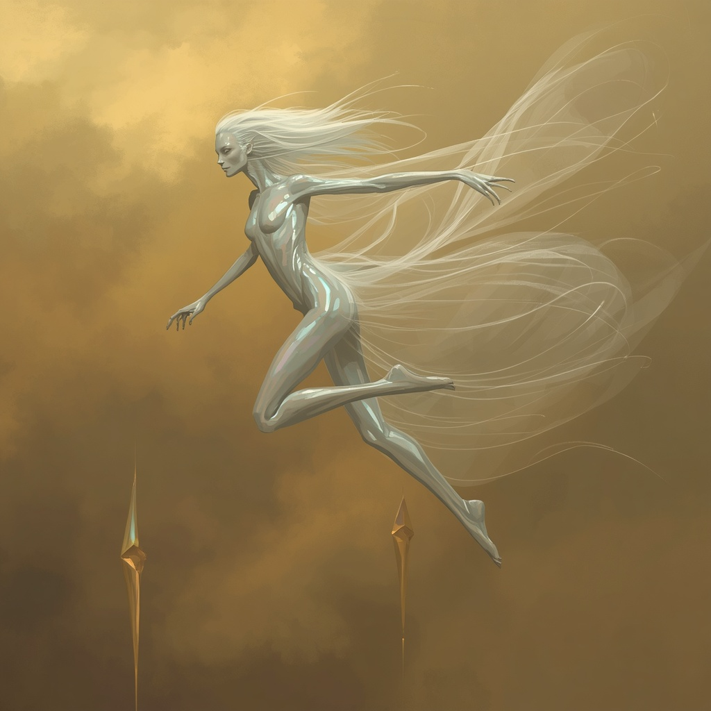

# The Veilborn — Setting Bible

> **Status:** the **Foundational Canon is locked** (the hidden cosmology below).
> The galaxy now has its sky. Systems get authored one by one and flowed into the
> map (`app/galaxy/data.ts`).
>
> This bible has **two layers**:
> 1. **The Veil** — the *public* cosmology, what the galaxy believes (travel, magic).
> 2. **Foundational Canon** — the *hidden* truth, **GM's eyes only**: what the
>    Voidmother really is, and the centuries-old lie told over it.

---

## Layer 1 · The Veil *(public cosmology — what the galaxy knows)*

### The Veil
The **Veil** is the eternal darkness that surrounds everything — the void between
and behind the stars. It is not empty: **behind it lies something incomprehensible.**
The Veil is the wellspring of magic, of travel, and of *the weird*.

### How it works
- **The Veilspinner** — the arcane engine in every ship. It **spins fragments of
  the Veil into reality** to fuel flight and warp travel.
- **Warp Skip** — to cross between systems a ship **slips through the Veil** to a set
  of coordinates and re-emerges elsewhere. Deeply **power-hungry**; never casual.
- **Magic** — mysteriously **fuelled by the Veil**, kept deliberately **ambiguous**
  so it rides atop *any* tabletop's magic rules. Casters draw on the Veil; the
  table's own system says how.

> What the galaxy does **not** know: what the Veil really hides, what the stars
> truly are, or what the dark thing at the map's edge is calling for. That is
> Layer 2.

---

## Layer 2 · Foundational Canon *(the hidden truth — GM's eyes only)*

> **The Star-Mother & the Hungry Void.** Almost no living being knows any of this.
> Treat it as the deepest layer of the campaign's mystery — the truth the whole
> galaxy was built on top of without knowing.
>
> *"She makes the stars. She lost the first to the dark. She will not lose the
> second — and the galaxy, sensing her grief wake, has begun to answer."*

### I. What the Voidmother truly is
She is not a monster in the dark. **She is where the light comes from.**

The being the galaxy calls the Voidmother is a **star-mother** — a cosmic entity
whose nature is the *creation of suns*. She drifts through the dark and seeds it
with warmth, carrying each new star from a **gestating egg** to a living, burning
body, guided every step by her own **arcane resonance**. Many of the suns of the
Veilborn may be her grown children. The galaxy lives in the light of her labour
without ever knowing her name.

An egg needs one thing above all to become what it's meant to be: **her presence —
her resonance.** The guidance isn't incidental to the process; *the guidance is the
process.* It is the difference between a star and a catastrophe.

> **The central truth.** A child guided in her resonance becomes **a star**. A child
> that hatches *without* her becomes its exact inversion — light turned inside out,
> a sun that consumes instead of gives: **a black hole.**

| Guided · in resonance | Abandoned · no resonance |
|---|---|
| **A Star** — light, warmth, the cradle of worlds. What every egg is meant to be. | **A Devourer** — a star turned inside out; a hunger where a sun should be. |

She knows at a glance when it is too late. Look upon a black hole and she
understands instantly that a star's window has closed — that you cannot un-collapse
a sun back into being. The threshold, once crossed, is **final**.

Her gestating eggs have a name in the oldest records: a **Hearthstone** — a star's
heart in its cradle, held in her **womb** (her region of resonance). A Hearthstone
is a thing of miracles: not only **limitless power**, but a force that **shapes and
restores matter, heals any wound, cures any sickness, and reverses ageing itself.**
Guided in her resonance it ripens into a sun. Torn out and drained, it **curdles** —
and, in time, hatches into a **Devourer.**

### II. The Keth'aal and the First Theft
Long before the present age, the galaxy's first great people were the **Keth'aal** —
a humanoid race of **silver scales and reptilian grace**, **strong in psionics**, who
lived two and a half centuries to a life. Their oldest scripture tells how they
**found the star-mother**: how, navigating the strange tides of her **resonance** and
studying her for decades, she became the **obsession of an entire species** — until
the day they breached her **womb** and found, cradled within, a **Hearthstone.**

They took it. Powered by a star's unborn heart, the Keth'aal rose to a height no
people had reached — its limitless energy and its miracles (matter remade, wounds
closed, age undone) theirs to spend. And spend they did, draining it for
**millennia**, hiding it from its mother all the while. They hid it so well, and so
long, that they doomed themselves: a Hearthstone kept from her resonance does not
ripen into a sun — it **curdles toward the dark.**

When the end neared, only one family saw it — the **Aurun Line**, an ultra-rich house
who read the signs, loaded a **fleet with their riches**, and fled their homeworld.
*(That fleet is the seed from which the Aureate Chain would one day grow — and the
Chain still, unknowing, carries the Aurun name.)* The rest of the Keth'aal stayed — and
watched **Sael'aan**, their world, their sun, and their entire people **swallowed** as
the Hearthstone hatched into the **Devourer** they had made.

> **The Devourer** *(VB-005)* is not an accident of the cosmos. It is a **stolen
> star-heart, drained and abandoned until it curdled** — Keth'aal hubris given a black
> hole's hunger. The oldest voices in its **Chorus** are the Keth'aal it ate.

### III. The Mother's Grief
The star-mother lost a child — **not to absence, but to theft.** Her Hearthstone was
torn from her womb, bled for ages, and left to curdle into the hungry thing now
brooding at the galaxy's edge. She **knows** the Devourer is her stolen child. She has
grieved it across an age, drifting **dormant in her own region** *(VB-008)* — aware it
is there, unable to undo what was done.

> **The asymmetry.** *She knows; it only yearns.* The Devourer — never ripened, never
> taught, its mind shaped by consuming — feels her only as a warmth at the edge of
> perception, a rightness it cannot name. Beneath the thousands of voices of its
> **Chorus**, all say one word, each heard in its own tongue: ***please.***

**Why she does not go to it.** A curdled child cannot be un-made; proximity changes
nothing, and two beings of that scale in contact could be catastrophe for everything
near. She stays apart not from indifference, but because closeness offers no remedy.
But she is not only grief — because somewhere out there is **another Hearthstone,
freshly stolen**, and *that* one is not yet lost.

### IV. The Stargiver and the Second Theft
The fled house — the **Aurun Line** — endured in the dark, dwindling across
generations, carrying their riches and their terrible knowledge — until, long after,
the last of that line was born: **Iss'reth Aurun**, the one the galaxy would come to
call the **Stargiver.** He grew up knowing
what his ancestors knew — what the star-mother is, where her womb lies, and what
sleeps cradled within it. **By the time he reached the Veilborn's heart he was, so far
as anyone knows, the last living Keth'aal.**

He came to **Twin Embers** — then a Renaissance world — and over **69 years** lifted
it to the computer age and the stars (the **Quickening**), becoming its messiah. On
his ancestors' fortune he raised the **Aureate Chain** and built his seat at
**Ember's Rest** — making the Twins the heartland of production, technology, and
commerce in the whole Veilborn. And all the while he searched — until at last he
**charted the womb of the star-mother.**

He brought the **finest the Arcane Survey had** to that hidden place. They found the
womb again; they found the **Hearthstone.** And there — **222 years ago** — he
**murdered the entire expedition** to bury what they had seen, took the star-heart for
himself, and from its age-reversing power became **immortal.** He raised the **City of
Pearls** upon the stolen Hearthstone, and entered its mother, in the permanent record,
as the **Voidmother.**

> **The clock — the Reckoning.** The Hearthstone has now been kept from her resonance
> for **222 years**, bled to power an empire and sustain one immortal man. Like the one
> before it, it is **curdling.** If it hatches outside her resonance it does not become
> a sun — it becomes a **second Devourer**: a black hole born in the **gilded heart of
> galactic civilisation**, beneath its richest and most beautiful city. The **Reckoning** is
> the star-mother, twice robbed, stirring at
> last to reclaim her second child before the first one's fate claims him too — and the
> galaxy itself, sensing the egg come into play, beginning to answer.

### V. The Naming
The Stargiver knew exactly what she was when he charted her — a **star-mother**, the
maker of suns. And he set into the permanent record not *star-mother*, not *the one
who lights the dark*, but **the Voidmother**: naming the cradle of stars after the
void that devoured his people, and burying her true nature under a slur the whole
galaxy would repeat forever without understanding it.

> *"He named the maker of suns the mother of darkness — and made the whole galaxy
> repeat it, forever, without ever knowing the joke was his."* — on the naming of
> VB-008

Whether spite, grief, or both — a burial of the thing that doomed his kind under a
curse, or simple bitterness made permanent — the result is the same. Every Survey
cartographer who files on the Voidmother, every pilot who prays not to drift toward
her region, unknowingly repeats it. And **she knows.** Between the two of them the
name is an open wound only they understand.

> **The true-name thread.** Somewhere — in the oldest Keth'aal records, from when she
> was their obsession rather than their doom — there may be a word for what she *truly
> is*: her real name, a word that means *the one who lights the dark.* One of the
> campaign's most powerful possible beats: the players learning it and **speaking it to
> her** — the first in ages to call her what she is, undoing the lie with a word.

### VI. Master Timeline

**The Deep Past — the Keth'aal** *(all dates approximate; deep history)*
- **~5,000–7,000 YA — The Obsession & the Breach.** The **Keth'aal** — silver-scaled,
  psionic, the galaxy's first great people — find the star-mother and, across decades
  of study, become consumed by her. They breach her **womb** and take a **Hearthstone.**
- **The Long Draining (the millennia that follow).** Keth'aal civilisation is powered
  by the star-heart — its limitless energy and its miracles (matter remade, wounds
  healed, age undone) — hidden all the while from its mother.
- **~3,000–4,000 YA — The First Reckoning.** The Hearthstone curdles. One rich house
  foresees it and **flees with a fleet of riches** *(the seed of the Aureate Chain)*;
  the rest are **swallowed** as the star-heart hatches into the **Devourer** *(VB-005)*.
  The star-mother loses a child to theft and withdraws, grieving, into her region
  *(VB-008)*. *(This sets the Devourer's age.)*
- **The millennia of exile.** The fled house **dwindles across generations** in the
  dark — until, long after, the last of the line is born: the **Stargiver.**

**The Present Age**
- **Deep antiquity → ~330 YA — The Rise of Twin Embers.** Long after the Keth'aal
  fall, **Twin Embers** grows on its own to ~Renaissance level (universities, early
  science, nations; no spaceflight). Among its institutions: the **Arcane Survey**,
  then just scholars and cartographers theorising about stars they cannot reach.
- **~330 YA — The Coming.** The **Stargiver** — last of the Keth'aal, heir to the fled
  house and its knowledge — arrives at Twin Embers carrying technology and
  understanding far beyond it.
- **The Quickening (~330 → ~261 YA, 69 years).** He lifts the Twins from the
  Renaissance to the computer age and on to the stars, becoming their **messiah** and
  the seed of the **Faith of the Stargiver.** He raises the **Aureate Chain** on his
  ancestors' fortune, builds his seat at **Ember's Rest**, and **unites the Twins'
  nations into a single realm — the Ascendant Throne** — making the Twins the
  **heartland of production, technology, and commerce** in the whole Veilborn. *(Both his
  legacies — the Chain, his company, and the Throne, his people — are founded here, while
  he still walks among them.)*
- **~261 → 222 YA — The Charting.** He explores and builds for a generation, and at
  last **charts the star-mother's womb.**
- **222 years ago — The Second Theft / the Ascension.** Having charted the star-mother's
  womb, the Stargiver leads the Arcane Survey's best to it, **murders them all**, takes
  the **Hearthstone**, and becomes **immortal** from its power. He raises the **City of
  Pearls** upon the stolen star-heart and enters its mother in the record as the
  **Voidmother.** *(The expedition's buried log may yet survive.)* **The public face:**
  he broadcasts the **Last Transmission** — recasting the massacre as a heroic
  **martyrdom** ("we died stopping a cosmic horror; never go to the Voidmother") — and so
  "dies," ascends to legend, and disappears into hidden rule before anyone can mark that
  he no longer ages.
- **222 years ago → present — The Long Erasure & the Living God.** He buries the truth
  — deleting records, silencing witnesses — and reigns from the shadows as an immortal
  **living guide** behind a vast public faith that believes him a dead martyr. He
  cultivates the **Silver Coil**, using mass devotion as a recruitment funnel for his
  inner circle of assassins.
- **The Present — player-initiated — The Reckoning.** After 222 years out of
  resonance the Hearthstone nears its hatching; the star-mother stirs, her
  **Convergences** begin, and the long-buried truth starts to surface. The Reckoning's
  overture — its stages unfold fluidly from here, measured in relative time from the
  moment the players trigger it.

### VII. Who knows the truth
| Who | What they know |
|---|---|
| **The Stargiver** | Everything — the knowledge his house carried out of the Keth'aal fall, plus what he took for himself. The only being alive who understands it whole, and the one who buried it, named her in mockery, and built an empire on the theft. |
| **The cosmic entities** | The star-mother and the Devourer themselves — though the Devourer only *yearns*, without the framework to grasp what it reaches for. |
| **The Chorus** | The consumed **Keth'aal**, compressed inside the Devourer — the dead who remember what she is, still saying *please.* Their oldest memory may hold her **true name**. |
| **A Vanishing Few** | Those who've glimpsed a piece: **Thessaly Vorn** within the Voidmother; **Vael Aren** within the Chorus; perhaps a fragment in the Survey's deepest **Tier-5** records, or the buried expedition log. |

> **For the GM.** To the ordinary peoples of the Veilborn, the idea that stars are
> *born* — that the black hole at the edge of the map is a curdled sibling of the sun
> they live under, made by hands like theirs — is unknown. Deliver it as a
> thunderclap: the truth the whole galaxy was built on top of without knowing.

### VIII. The Unravelling — the clue-trail *(🛠️ GM draft — to be refined later)*
How the truth surfaces in play: **not a line but a web with a ladder.** Many small clues across
several threads, pickable in any order, all bending toward one center. A crew lands to do mundane
gilded-core jobs and keeps brushing the truth until it cannot unsee it.

**The four tiers — what the crew comes to believe:**
1. **"Something's off."** — scattered itches.
2. **"Someone's hiding something, and kills to keep it."** — the cover-up.
3. **"The martyr is alive."** — the Stargiver never died.
4. **"He stole a star, it's under the City, and it's becoming a black hole."** — the theft and the
   cosmology.

**Tier 1 — the splinters** *(low-stakes, planted while doing other jobs; any one can start it):*
- **Green archive (Verdania):** a translated Keth'aal record drops the word *star-mother* and the
  rumour *someone found her.*
- **The sabotage (Glacius):** the Chain's "saboteur" problem is too organised to be weather or
  beasts — and the official line is a lie.
- **The too-kind faith (the Aureate Collective):** a new sect, suspiciously rich and pro-Chain,
  that deflects about its funding.
- **The brush-by erasure:** a contact who knew an odd thing vanishes; a record the crew saw is
  quietly gone.

**Tier 2 — the cover-up** *(pull a thread, and something pulls back):*
- The Collective → the **Silver Coil** beneath it (erasers; **Vesh #3** answers upward).
- The Glimmerkin → the Chain would **erase a whole people** rather than admit the deep is
  inhabited.
- The Survey (Shimmerview, the Cartographer, or the old Sanctaris HQ) → vanishing findings, the
  **Cell**, and Tier-locked gaps around a buried founding scandal.
- **Gate:** here the Coil notices the crew, and the **Vesh'kaar** ladder begins (higher numbers
  first).

**Tier 3 — the living martyr:**
- **The leash:** a hush-hush VIP cycles back to the City of Pearls and **never ages.**
- **The Coil's creed:** the Coiled serve a **living guide**, not a dead martyr.
- **The Aurun thread:** the **Aur**eate Chain carries a buried **Aurun** (Keth'aal) name.
- **The buried log** *(→ the Voidmother)*: the first-expedition record shows the Ascension was no
  martyrdom.

**Tier 4 — the theft & the doom** *(the basement, then the cosmos):*
- **The basement:** the City's impossible power-core is a **stolen Hearthstone**, hidden as
  infrastructure.
- **The Devourer / the Chorus:** what a stolen star-heart *becomes*, and the Keth'aal who made the
  first one.
- **The Voidmother:** the scene of the theft, her true nature, the prohibition that hides the
  crime.
- **The cosmology:** the *star-mother* named back in Tier 1 **is** the Voidmother **is** the maker
  of suns — the Hearthstones, the **Reckoning**, and the unbearable fix: *return the stone, and the
  Stargiver dies with it.*

**Running it:** *any entry, one center;* **the gate is the Coil** (1→2 free, 2→3 wakes the
hunters); **Lotus is the wildcard** atop the basement; and **it outlives Solara Prime** — the
deepest clues lead out to the Voidmother, the Devourer, and Twin Embers.

> **Status — draft.** First pass of the trail's *shape* only. To refine later: concrete named
> clues (specific NPCs, documents, sites) for each beat; pacing and triggers; and how it threads
> through the other systems as they are authored.

---

## Key entities *(quick reference)*

- **The Voidmother** — the star-mother (true nature hidden); her womb/region is
  charted **VB-008**. The galaxy fears the name; only a few know it's a slur.
- **The Devourer** *(VB-005)* — a curdled, stolen **Hearthstone**; the black hole at
  the galaxy's edge; the grave of **Sael'aan** (the Keth'aal homeworld) and source of
  the **Chorus**.
- **The Hearthstone** — a star-mother's gestating star-heart: limitless power and
  miracles (restoration, healing, anti-ageing), but it curdles into a Devourer if kept
  from her resonance. The first was the Keth'aal's doom; the second is stolen now,
  powering the **City of Pearls** and sustaining the Stargiver — the Reckoning's clock.
- **The Stargiver** *(true name **Iss'reth Aurun**)* — the immortal antagonist; **last
  of the Keth'aal**, heir to the Aurun Line that fled the first Devourer; uplifter and
  messiah of Twin Embers (the **Faith of the Stargiver**); founder of the Aureate Chain;
  made immortal by the stolen Hearthstone 222 years ago. A **charming predator** on a
  **hidden leash** to the stone, serenely certain he can master the curdling that
  doomed his people. *(Full entry above.)*
- **The Aureate Chain** — chartered trade empire, openly the **messiah's own company**
  (he founded it in the Quickening); founded on the **Aurun Line's** fled Keth'aal
  fortune (and secretly named for it); the Stargiver's apparatus guarding his stolen
  Hearthstone, his secret, and his rule.
- **The Ascendant Throne** — the theocratic empire of **Twin Embers** (short: the
  Ascendancy); the Stargiver's chosen people, the Faith made a state; ruled by the
  **First Light** in the name of the Ascended One whose **throne stands empty** at
  Ember's Rest. The messiah's *people* to the Chain's *coin* (an uneasy holy
  partnership); a Twin Embers superpower; genuinely independent but **courted by the
  Silver Coil**; the prohibition's fiercest enforcer. *(Full entry above.)*
- **The Faith of the Stargiver** — the galaxy's dominant religion; reveres him as a
  martyred saviour; symbol the **silver serpent** (pendant). Clergy: Lampbearers →
  Foundry-Fathers/Mothers → Radiants → the **First Light**. Holy days: the **Coming**,
  the **Quickening**, the **Ascension**.
- **The Ascension / the Last Transmission** — the founding lie: the 222 YA massacre at
  the womb sold as the Stargiver's heroic **martyrdom**; his final command — *never go
  to the Voidmother* — is why the galaxy shuns that system as holy ground.
- **The Silver Coil** — his hidden inner circle (named for the serpent), recruited
  through the public faith; tiers Faithful → Called → **Coiled** → **Vesh'kaar** →
  Stargiver; its elite are the **seven Vesh'kaar** (master assassins ranked 1–7; Mirreth
  is #4, the spymaster is #1). They guard the secret that he still *lives* — never
  knowing they also hide the Hearthstone doom.
- **The Keth'aal** — the extinct progenitor species (silver-scaled, psionic) whose
  theft of the first Hearthstone made the Devourer and doomed them; homeworld
  **Sael'aan** (now the Devourer); known publicly only as the **"First People"**; the
  Stargiver (of the **Aurun Line**) is their last scion. *(Full entry above.)*
- **The Chorus** — the compressed voices of all the Devourer has consumed (the
  Keth'aal oldest among them); they say *please.*
- **The Arcane Survey** — began as Twin Embers scholars/cartographers; now the
  galaxy's mapping authority (deepest records: **Tier-5**).
- **Twin Embers** — heartland of the present age's foremost civilisation; where the
  Stargiver arrived (the Coming).
- **The City of Pearls** — built on the stolen Hearthstone (in **Solara Prime**).
- **The Reckoning** — the metaplot endgame: the star-mother, twice robbed, racing to
  reclaim her second child before he curdles into another Devourer.

---

## The Keth'aal — the First People
> **🔒 GM-only canon.** Everything below is hidden truth. The galaxy *does* meet the
> Keth'aal — but only as **ruins, relics, and a name** (see "The public face"). That
> they made the Devourer, and that the Stargiver is one of them, is the deepest secret
> in the setting.

The Keth'aal were the **first great civilisation of the Veilborn** — risen, ascendant,
and gone long before Twin Embers lit its first lamp. They are the setting's
**precursor mystery** and its **original sin**: the people who found god, robbed her,
and made the Devourer that ate them. Every cosmic horror in the galaxy traces back to
their hubris, and the last of them rules it still.

### What they were *(body & mind)*
- **Silver-scaled and reptilian** — a tall, graceful, cold-blooded humanoid people;
  mirror-bright scales, slit eyes, an unhurried elegance. Beautiful and a little
  uncanny to warmer-blooded folk.
- **Long-lived — 200–250 years.** They thought in **deep time**: patient, generational,
  building works and plans meant to outlast any single life. A people in no hurry —
  which is part of how they justified draining a star for *millennia*.
- **Strongly psionic.** Psionics was the spine of their culture: how they spoke
  mind-to-mind, made art, kept memory, and — crucially — how they **sensed the
  star-mother's resonance** in the first place. Their greatest minds could *feel* the
  current that lights the suns. *(This is also why their consumed dead persist so
  loudly in the Chorus — psionic minds don't go quiet.)*

### Their civilisation
- **Space-faring and far-reaching.** They crossed systems under their own power, which
  is how they ever found the star-mother at her womb *(VB-008)*. Their cradle and
  capital was **Sael'aan** — *"the silver cradle"* — the world that is now the
  **Devourer** *(VB-005)*. Their homeworld is their grave: the black hole at the edge
  of the map *is* Sael'aan, and the people inside it.
- **A culture of millennia.** Monumental, patient, psionically literate; ruins of it
  still stand scattered across the galaxy, thickest toward the Devourer.
- **A faith of the star-mother.** Their **oldest scripture was the finding of her** —
  she was the centre of their religion long before she became their battery. They knew
  what she was: the maker of suns. They may be the only people who ever knew her
  **true name.**

### The Obsession, the Hubris, and the Fall
The arc is in the Foundational Canon and on the [timeline](timeline.md); in brief:
- **~5,000–7,000 YA — they breached her womb** and took a **Hearthstone**, turning
  worship into theft.
- **The Long Draining** — for **millennia** they ran their golden age on a stolen
  star-heart and its miracles (matter remade, wounds healed, age undone), hiding it
  from its mother all the while.
- **~3,000–4,000 YA — the Fall.** The Hearthstone curdled. The **Aurun Line** — an
  ultra-rich house — read the signs and **fled with a fleet of riches**; the rest
  stayed and were **swallowed** as the star-heart hatched into the **Devourer** that
  ate Sael'aan, its sun, and its people.

> **Their sin in one line:** *they found god, bled her child for an age to light their
> empire, and in doing so forged the hunger that devoured them.*

### What remains in the present
- **The Chorus.** The consumed Keth'aal are the **oldest voices** in the Devourer's
  Chorus — psionic minds compressed but not silenced, still saying *please.* The
  galaxy's only surviving Keth'aal *consciousness*, and the likeliest keeper of the
  star-mother's **true name**.
- **The Stargiver.** The last living Keth'aal — sole scion of the **Aurun Line**, made
  immortal by a *second* stolen Hearthstone 222 YA. The species' last act is also its
  worst: he repeats their crime, knowingly.
- **Ruins & relics.** Precursor sites, dead-tech, and **psionic artefacts** strewn
  across the galaxy — prime exploration and treasure. Psionic relics may *resonate*
  near the star-mother or the Devourer in ways no one can explain (because no one
  remembers what the Keth'aal knew).
- **The records.** Fragments of Keth'aal language and scripture survive in ruins and in
  the Survey's deepest vaults — the thread that, fully pulled, yields the **true name**.

### The public face *(🔓 what the galaxy actually knows)*
The peoples of the Veilborn know there was a **"First People"** — an ancient,
vanished precursor race whose silver-scaled ruins and psionic relics turn up across
the systems. The **Arcane Survey** catalogues their sites and covets their artefacts;
treasure-hunters and scholars chase them. **No one connects them to the Devourer or
the Stargiver.** To the galaxy they are a romantic archaeological mystery — *"who were
the First People, and what killed them?"* — not the answer to the cosmic horror at the
edge of the map. *(The Survey's now-**abandoned station in the Devourer system** was
studying First-People ruins there before it was pulled — a thread that runs straight to
the truth.)*

### At the table
- **Exploration & treasure.** Keth'aal ruins are ready-made dungeons and wonder-sites;
  their psionic relics are tech and rewards with strange behaviours near VB-005/VB-008.
- **The slow-burn horror.** The First-People mystery the players chase for fun
  *becomes* the cosmic-horror reveal: the precursors made the Devourer, and the living
  god they may already serve is the last of them.
- **The true-name quest.** Reassembling Keth'aal records — or reaching into the Chorus —
  toward the word that means *the one who lights the dark.* One of the campaign's most
  powerful possible beats.
- **Optional GM thread — the last question.** Canon holds the Keth'aal **extinct**, the
  Stargiver the last. A GM who wants it can leave one ember: a single hidden survivor,
  a sleeper-vault, a second exile line — a knife aimed at the immortal who thinks he's
  alone. Left deliberately open.

> **The Aurun Line — a secret in plain sight.** The fled house's name lives on,
> hidden, in the empire it founded: the **Aur**eate Chain still carries the **Aurun**
> name, and no one alive knows why. A player who learns the Keth'aal once had an Aurun
> dynasty holds a thread that ties the galaxy's economy straight to its original sin.

> **Status.** Homeworld **Sael'aan** and lineage **the Aurun Line** are locked.
> Keth'aal **psionics stays flavour-only** for now (relics behave strangely, the
> Chorus persists) — any table mechanics defer to the rules track.

---

## The Stargiver — *Iss'reth Aurun*
> **🔒 GM-only.** The galaxy knows him only as **the Stargiver**, and believes he is
> long gone. His true name — **Iss'reth Aurun**, last heir of the Aurun Line — is known
> to almost no one alive. He is the **central antagonist**: the immortal who built the
> modern galaxy, hid its original sin, and is quietly steering it toward a second.

The last living Keth'aal, sole scion of the **Aurun Line**, made deathless 222 years
ago by a stolen **Hearthstone.** To billions he is a beloved messiah of the deep past;
to a tiny cult he is a living god; to the truth he is a **charming, brilliant predator**
who is repeating his species' exact catastrophe — and is serenely certain he won't.

### The three faces
| Face | Who holds it | What they see |
|---|---|---|
| **The martyred saviour** | The galaxy / the Faith *(🔓)* | The alien who gave the stars, then *died a martyr* at the Voidmother stopping a cosmic horror — mourned every Ascension, his dying command obeyed galaxy-wide. |
| **The living guide** | The Silver Coil *(🔒)* | He *still lives*, walks among them, and directs them. They kill to keep this secret. |
| **Iss'reth Aurun** | Him alone *(🔒)* | The Keth'aal who stole a star, murdered to keep it, and intends to master what killed his world. |

### Character — the charming predator
He is **magnetic, gracious, and genuinely brilliant** — the most likeable person in any
room, and he made the room. The uplift of Twin Embers was *real*; he lifted billions
from candlelight. But the good was always **instrumental**: it bought him the Chain, the
Survey, an industrial base, and the adoration he enjoys. He treats people as **pieces** —
collects loyalty, rewards usefulness, and removes obstacles without heat — and he
**delights in the long game.** Not a ranting tyrant; a patient, warm, reasonable man who
will charm you, use you, and have you erased over dinner if you become inconvenient.
*Terrifying precisely because you'd like him.*

*(Psionic edge — flavour: he reads people effortlessly, his charm has a pull that isn't
quite natural, and he can feel the star-mother's resonance the way his people once did.)*

> **The most depicted face no one may see.** His silver-scaled likeness stands in every
> temple-foundry on Twin Embers, and the **silver serpent** — his coiled image — hangs at
> a billion throats as the Faith's holy symbol. So the one face the whole galaxy would
> recognise is the one he must now hide. When he moves among the living he conceals his
> scales; the god is a fugitive inside his own religion, passing crowds who wear him
> without knowing it.

### The fatal certainty *(his engine)*
He **knows** the stolen Hearthstone is curdling toward a second Devourer — he has watched
this exact process before, with his own world. And he is **calmly, completely sure he
will master it.** Where the Keth'aal failed, *he* will succeed: he has centuries the
ancients didn't, the Chain, the Survey, and a mind he rates above all of theirs. To him
their fall wasn't a law of the cosmos — it was **carelessness**, and he is not careless.

> **His blind spot — the thing he cannot accept.** *Only the star-mother's resonance can
> ripen an egg safely. There is no substitute, and there never will be — not for the
> Keth'aal, not for him.* He is certain he can engineer one. He is wrong in the precise
> way his ancestors were wrong, and his contempt for their failure **is** his denial. He
> is Sael'aan happening again, narrated by a man sure it's a different story.

This makes the campaign's truth unbearable to him: the **only** way to stop the Devourer
is to **return the stone to its mother** — which he dismisses as crude, defeatist waste
*and* which would **end his life.** He will kill anyone who tries to "throw away" the
solution he's certain he'll find.

### The leash — his immortality and its flaw
The Hearthstone didn't remake him once and let him go; it holds him on a **hidden
leash.** He must **periodically return to its resonance** — the heart of the **City of
Pearls** — or his deathlessness begins to fail and the lost centuries start to catch
him. Between returns he can range the galaxy freely; but the leash always pulls him home.

- It **roots his geography** (he is bound to the City of Pearls) and gives a **clock** on
  his absences — a vulnerability a sharp crew could chart.
- It seals the **central trap**: his life and the galaxy's doom are the **same object.**
  To save everyone, the stone goes home — and the Stargiver dies with it. He knows this,
  and it is the one outcome he will spend anything to prevent.

### How he operates
A **hidden hand.** Presumed gone, he rarely appears as himself; he steers through the
**seven Vesh'kaar** (Mirreth is #4; the spymaster-leader is #1) and the wider **Silver
Coil**, with the **Aureate Chain** and the corrupted pockets of the **Arcane Survey**
as his instruments. When it amuses or matters he moves **in person and in disguise** —
a charming patron, a quiet investor, a kindly stranger — hands-on in the game he loves.

### A modern annoyance — the rival he made
His sharpest present-day irritation is **self-inflicted.** The **Ascendant Throne** — the
empire of his own worshippers — has spent centuries quietly bleeding influence from the
**Aureate Chain**, his primary instrument, precisely *because* of how devoutly they love
him. The galaxy keeps choosing the messiah's *people* over the messiah's *company*, and so
his cult of personality is slowly strangling the very apparatus he hides behind. He
**cannot openly crush the Throne** — suppressing the devotion would undermine the faith
that conceals him and the recruiting ground that feeds the Coil — so instead he must
**court it from the shadows** (the Coil's quiet infiltration), clawing back through
manipulation what his own myth keeps giving away. A god losing a turf war to his own
religion, unable to admit either exists.

### The one crack
He does not go to the **Devourer.** He calls it strategy — too dangerous, nothing there.
The truth he won't say is that it is **Sael'aan's grave**, and the **Chorus** carries the
compressed voices of *his own people*, still saying *please.* The serene predator has
exactly one place his certainty won't follow him. A crew that understands why may hold
the one lever that reaches the man under the mask.

### At the table
- **Meet him before you know him.** Introduce him early as a charming benefactor or
  patron (in disguise); let the players *like* him. The reveal should hurt.
- **His defeat is his death**, and he will never accept the premise — so he can't be
  reasoned into surrender, only out-maneuvered. The drama is the players carrying a truth
  he refuses, against a man everyone loves.
- **Levers against him:** the **leash** (his returns to the stone); the **Devourer / the
  Chorus / his true name** (the one place and word that unmake his composure); the
  **buried expedition log** and the **Survey rot** (proof of the theft); the
  **Aureate = Aurun** thread (his hidden identity in plain sight).

---

## Factions *(in progress)*

### The Aureate Chain
- **Public face:** the galaxy-spanning chartered trade hegemon. Seat: the **City of
  Pearls** (on Caelum, Solara Prime). Heartland: **Twin Embers** (~60% of system
  commerce through Chain intermediaries). To most of the Veilborn, it simply *is*
  civilisation — *"and civilisation has a price the Chain sets."* Crucially, it is
  **openly the messiah's own company** — the Stargiver **founded it himself during the
  Quickening** (~330–261 YA), and it carries his golden name; that legacy lends its
  authority a near-sacred weight, and binds it to the **Ascendant Throne** as the
  messiah's *other* legacy *(an uneasy holy partnership — see the Throne).*
- **Hidden truth:** the **Stargiver's** apparatus — founded on the fortune his house,
  the **Aurun Line**, fled the Keth'aal homeworld with, now guarding his stolen
  Hearthstone and his secret — steered from within by the **Silver Coil** (his cult
  of assassins). Most of the Chain is unwitting cover for a tiny secret core.
  *(The very name **Aur**eate is the buried Aurun name — a clue hiding in the brand on
  every crate in the galaxy.)*

**Its true power — the means of travel.** Warp Skip is power-hungry and the void is
lethal to the unprepared, so whoever controls **charts and fuel** controls the
galaxy — and that is the Chain:
- **The Charts.** The Arcane Survey maps; the Chain *licenses* the maps. Safe
  Skip-coordinates are Chain property — fly uncharted and you gamble your ship.
- **The Fuel.** Refined **aether** (Veilspinner fuel) flows through Chain depots.
  Cut off, you do not fly.

This makes the Chain the natural **patron *and* antagonist** of any crew that wants
to explore — charting the dark is *their* turf. *You can go anywhere in the galaxy —
as long as the Chain sells you the map and the fuel to get there.* (Other levers —
debt on financed hulls, charters, "protection" — hang off this core.)

**The one place its grip is slipping.** For all its galactic dominance, the Chain is
**losing the heartland.** In Twin Embers the devout increasingly favour the **Ascendant
Throne** — the messiah's *people* — over his mere *company*; commerce that once ran
through Chain intermediaries stays within the Throne's faithful networks, and its hold on
the richest system in the galaxy erodes **year by pious year.** *(It galls the Chain's
true master more than anyone could guess — see the Stargiver.)*

**Structure (the public body).** **Chain-Lords** (regional sovereigns) · **Counting
Houses** (the bureaucracy — manifests, contracts, debt, fees) · the **Ironbound**
(the "we have no military" military) · **Factors** (agents and fixers) ·
**Charterhands** (the chartered captains — *where most crews sit*). The **Silver
Coil** runs invisibly through all of it.

**Leadership — the two faces:**
- **Chain-Lord Lotus Silverblood** *(City of Pearls, Solara Prime)* — the Chain's
  public sovereign. **Does *not* know** about the Stargiver or the Silver Coil.
  He believes the Chain is exactly what it appears: a trade empire. The honest face
  atop a lie he's never seen — a potential tragic ally. *(Secretly shielded and kept
  clueless by Mirreth, who finds an honest sovereign the perfect cover.)* *(Full entry under
  Solara Prime.)*
- **Chain-Lady Mirreth** *(commands the Ironbound, Twin Embers)* — **Silver Coil; the
  iron fist of the Twins, and secretly **Vesh #4** of the seven.** Her commercial and
  military command is a front for the cult's true work, and she is the Coil's armoury —
  the Chain's hard power and best war-tech, at the Stargiver's disposal. Where the
  Chain's public power and its secret one quietly meet. *(Full entry under the
  Vesh'kaar.)*

**Reach — the Presence Ladder** *(canon; a reusable faction-reach tool — generalise
in the Forge):*

> **Administrative HQ → Dominant → Active → Covert → Limited → Classified → Unknown
> → Minimal**

The Chain's current standing by system (from the map): **Solara Prime** Admin HQ ·
**Twin Embers** Active *(commercially vast but slipping — the Throne is sovereign here)* ·
**Azuran Deep** Active · **The Great Lighthouse** Limited ·
**Pale Cipher** Covert · **The Voidmother** Classified *(the Hearthstone extraction)*
· **The Devourer** Unknown · **Crimson Maw** Minimal.

**At the table.** The Chain's **posture is player-driven** — it bends to how the crew
treats it — but the default arc is *the employer they come to resent.* A crew's
starting **leash** is the DM's pick, and each is a ready story hook: **debt** (you
owe the Chain your hull), a **charter** (you fly its contracts for lane & fuel
access), or an **explorer's license** (you need its charts). Any or all can run at
once.

### The Arcane Survey
The galaxy's **cartographers, natural philosophers, and great library** — born in
Twin Embers, now the mapping authority. Their creed: *the map must grow.* They sail
toward the beautiful and the terrible because *not knowing* is unbearable — the
setting's engine of **wonder and dread.**

**Two seats.** The order's **founding HQ stands in Sanctaris** (Ember's Rest, Twin Embers) —
the **oldest and proudest** seat in the Survey, raised **before the Stargiver ever came**, and
the very wellspring of knowledge he tapped to set off the **Quickening.** Its great
**library-station, the Cartographer**, hangs in **Solara Prime**, the gilded core: the **Great
Chart**, the Tier-locked vaults, the relic-labs, and the working heart of the modern order.
*(The Cartographer is **Chain-funded** — a marvel that size isn't run on a creed, and the debt
is one of the leashes by which the Chain grips the Survey.)*

**What they hold.**
- **The Charts.** The system catalogue (**VB-### designations**), anomaly
  classifications, and the safe Skip-coordinates. *The Survey maps; the Chain
  licenses the maps* — knowledge vs. commerce.
- **The Library.** More than charts: **information.** Deep records on systems,
  worlds, and moons (astronomy, geography, ecology) — and, sometimes, **hidden or
  political intelligence.** Knowledge is the Survey's true coin; a crew can
  *research* here as readily as resupply.

**The Tier system** *(clearance = secrecy = progression):* Tier 1–2 public · Tier
3–4 restricted (dangerous anomalies, sealed systems) · **Tier 5 forbidden** — the
deepest vaults, where fragments of the truth sleep (perhaps the buried
first-expedition log). Earning clearance unlocks deeper maps, deeper intel, and
deeper dread.

**The station network.**
- **Active stations** on every *safe* system: **Solara Prime, Twin Embers, Azuran
  Deep, Pale Cipher, The Great Lighthouse.**
- **Abandoned stations** adrift in **The Devourer** and **The Voidmother** — outposts
  the Survey was forced to flee, now derelict sites haunting the galaxy's two deepest
  mysteries (prime adventure locations).
- **No station** in **Crimson Maw** — too hostile to ever hold.

**Relationship to the Chain.** Nominally independent, increasingly **leashed** by
Chain funding and licensing; some scholars have begun to notice findings quietly
going missing.

**Hidden within — contested ground.**
- **The Cell** — a secret circle of Survey members investigating the **founding
  expedition.** They are the crew's likely **on-ramp to the Hearthstone mystery.**
- **The rot** — corruption and planted **Silver Coil** members who surveil,
  suppress, and serve the Stargiver. The Survey is a battleground between those who
  want the truth out and those who keep it buried.

**Fault lines.** *Open Hand* (publish everything) vs *Sealed Vault* (lock the
dangerous) · the Cell vs the infiltrators · the **buried wound** — their founding
expedition was murdered by the man much of the galaxy reveres.

**At the table.** The Survey is the crew's **cleanest patron** — charters to explore,
paid in coin *and* clearance; a **library** to research worlds, secrets, and people;
and, through the Cell, the doorway to the metaplot. Where the Chain's jobs
*compromise* you, the Survey's jobs *tempt* you — toward the truth.

### The Faith of the Stargiver *(the public church)*
Roughly three and a half centuries ago an **alien man** descended on **Twin Embers**
— then a Renaissance world of universities and nations. Within **69 years** he dragged it
from the Renaissance into the **computer age**, and onward to the stars. To the
people it was a miracle; to history it was the birth of the modern galaxy. Then, the
faithful believe, he **gave his life to save them** — and they have worshipped him ever
since. It is the **dominant religion of the Veilborn**, and on Twin Embers it is the
state, the guild, and the soul of the economy all at once.

**What the faithful believe.** He is a **messiah** — the *Stargiver*, who lifted them
from candlelight and gave them the heavens, and who then **martyred himself** stopping a
cosmic horror (see *the Ascension*, below). They revere him as a **hero of the past,
dead and ascended.** They do **not** know he still lives (*that* is the Silver Coil's
secret), and have no inkling of what their devotion truly serves. Theirs is a
**genuine, joyful, grieving, beloved faith.**

**The silver serpent.** The faith's holy symbol is the **silver serpent** — most often
worn as a **pendant**, coiled or descending, in memory of the alien who came down and
gave the stars. It is **everywhere**: at the throat of dockworkers and Chain-Lords
alike, etched over foundry doors, pressed into coins and contract-seals across the
Veilborn. To wear one simply means *"I am of the Faith,"* so it marks nothing useful —
the Silver Coil hides in that ocean of ordinary devotion, indistinguishable from any
other believer. *(🔒 The irony: it is a faithful likeness of him — the silver-scaled
Keth'aal — and of his whole dead reptilian people. Billions wear the image of a predator
and the emblem of the Devourer's makers at their throats, and call it grace.)*

**The clergy.** A public hierarchy, strongest on Twin Embers but reaching every system:
- **Lampbearers** — parish clergy; *"they carry the light he gave."* The face of the
  faith to ordinary people.
- **Foundry-Fathers / Foundry-Mothers** — preside over the **temple-foundries**, where
  worship and industry are a single act; as much guild-masters as priests.
- **Radiants** — regional high clergy; authority over many temples and foundries.
- **The First Light** — the supreme mortal head of the church. Sincerely believes the
  Stargiver ascended; has **never seen the truth** — an honest apex atop a lie *(a
  potential tragic ally, like Lotus Silverblood in the Chain)*.

**Holy days.**
- **The Coming** — the descent of the Stargiver (~330 YA). The high holy day of light,
  procession, and gratitude.
- **The Quickening** — a festival *season* celebrating the 69-year uplift: invention,
  industry, and the climb from candlelight to the stars. The Twins' grandest event.
- **The Ascension** — the solemn day of mourning. It marks the day he and his chosen
  crew **departed for the Voidmother** and gave their lives there. On it, the **Last
  Transmission** is read aloud in every temple, and the faithful **renew his final
  command.**
- **The Blessing of the Serpent** — a domestic rite; silver pendants are blessed,
  gifted, and passed down through families.

**The Ascension & the Last Transmission** *(the founding lie)*. The faith holds that, at
the height of his work, the Stargiver led an expedition to the system he himself had
named the **Voidmother** — to confront a **cosmic horror** stirring there. None
returned. His **last words**, broadcast back as the womb closed over them, are the
faith's holiest scripture: he **praises humanity**, names his crew **martyrs who died so
that a horror would never be born**, and lays down one final command —
> *"Grieve us, but do not follow us. Never go to the Voidmother. We closed that door
> with our lives; let no one open it again."*

🔒 **The truth.** There was no horror to stop — the "martyrs" are the surveyors he
**murdered** at the womb, and the Transmission is the cover story for the **theft of the
Hearthstone**. He did not stop a cosmic horror from being born; he *stole the seed of
one.* The prohibition isn't a warning — it's him **sealing the scene of the crime** with
the love of the entire galaxy, and dressing his disappearance (he had just become
immortal and could no longer be seen to age) as a saint's sacrifice.

**The prohibition — why no one goes to the Voidmother.** His final command is law of the
heart across the Veilborn: ordinary folk **shun the Voidmother system** as holy ground
and a grave, pilots pray not to drift toward it, and even the **Arcane Survey
abandoned** its station there. To sail for the Voidmother is not just dangerous — it is
**heresy against the martyr's dying wish.** *(The crew will, of course, eventually go.)*

**Twin Embers, the heartland.** His gift made the Twins the workshop and market of the
whole Veilborn — the galaxy's centre of **production, technology, and commerce**:
gleaming temple-foundries and exchange-cathedrals where worship and industry are one act.

**Place on the timeline.** The faith was **born during the Quickening** (~330–261 YA) as
gratitude curdled into worship; the **Ascension at 222 YA** turned a living benefactor
into a martyred god and let him vanish into hidden rule; and across the **Long Erasure**
(222 YA → present) it spread to become the galaxy's dominant religion.

**The iceberg.** The Faith is the surface; the **Silver Coil** is the blade beneath it,
quietly drawing the most zealous and useful from among the Faithful. The worshippers are
the unwitting ocean the cult swims in.

**At the table — the cruellest hard choice.** The religion is *real and good for
people.* He genuinely lifted billions from the dark; the prosperity is real; the faith
gives meaning. To expose the truth is to shatter a beloved church, topple the galaxy's
industrial heart, brand its martyr a fraud and a murderer, and tell billions the loved
one they grieve every Ascension was the monster all along. The players may end up
holding a truth that helps no one to speak — *do you tear down three centuries of light
to reveal the dark beneath it?*

### The Ascendant Throne *(the theocratic empire of Twin Embers)*
The **native superpower of Twin Embers** — the Stargiver's chosen people, raised from a
Renaissance world to a starfaring empire in living memory, and the **Faith made into a
state.** Where the Aureate Chain is the messiah's *coin*, the Ascendant Throne is his
*people and his faith.*

**The empty throne.** The chair it is named for stands **vacant and sacred** — at
**Ember's Rest**, the seat the Stargiver himself raised. It is the throne of the Ascended
One, kept forever for the god who gave his life; **no mortal may sit it.** The empire
rules *in his name*, a realm forever holding the chair of a saviour they believe can
never return.

**Government — the Faith as the state.** In Twin Embers the church *is* the government: a
true theocracy. The **First Light** — supreme head of the galaxy-wide Faith, seated in the
heartland — reigns as the Throne's mortal sovereign, the Ascended One's vicar. Below, the
**Radiants** serve as both bishops and governors of the empire's worlds (**Ember's Rest,
Twinreach, Vanthis**); the **temple-foundries** are at once churches, factories, and town
halls. *(The **Arcane Survey's founding HQ** stands in **Sanctaris** itself — an old, proud,
independent order the Throne hosts on its holy ground but has never ruled; see the Survey and
Ember's Rest.)* To be a citizen is to be of the Faith.

**Founding (on the timeline).** The Throne was forged **during the Quickening**
(~330–261 YA): as the Stargiver lifted the Twins' Renaissance nations to the stars, he
**united them into a single realm** while he still walked among them. After his
**Ascension (222 YA)** the living leader became a worshipped martyr-god, and the realm
became what it is now — a theocracy ruling his heartland and keeping his chair. It is the
**oldest established native power** in the modern galaxy, born of the same era as the
Chain he founded.

**The miracle people.** Their pride is total, and earned: they remember, in songs barely
old enough to be history, **rising from candlelight to starflight in three generations.**
The most devout population in the galaxy, and the most industrious — the **temple-foundry**
is their cathedral, and the galaxy's finest production and technology pour out of it. Holy
days are state days; the **silver serpent** is on every breast; the **Ascension** is the
empire's central solemnity.

**Reach — a Twin Embers superpower.** Dominant in its home system, its influence
(industrial, spiritual, economic) reaching across the galaxy — but **not yet a
multi-system empire.** A concentrated, formidable, righteous heart, not a sprawling
conqueror.

**The Chain — an uneasy holy partnership.** The Throne and the **Aureate Chain** are the
messiah's two legacies — his *faith* and his *company* — and in the heartland they are
**complementary sacred institutions:** the Throne governs and worships, the Chain trades
and funds, and the galaxy's richest system runs on both. They **cooperate** — but the
friction never quite cools. Each privately believes itself his **truer heir**, and the
devout Throne quietly judges that the Chain has let his coin **drift from his spirit into
mere greed.** A partnership of two crowns that smile, clasp hands, and watch each other.

And the **balance has been shifting.** The Throne owns the **temple-foundries** — the
*production* — and, more potently, the **souls**; the Chain owns only the *distribution*
(charts, fuel, routes). Across the long centuries, a faithful galaxy has steadily chosen
the messiah's *people* over the messiah's *company*: heartland commerce that once ran
through Chain intermediaries increasingly stays within the Throne's devout networks, and
the Chain's once-iron grip on the richest system in the galaxy has **slipped, year by
pious year.** The Throne is winning the heartland not by force but by faith.

> 🔒 **GM'S EYES ONLY.**
> - **Genuinely its own power — for now.** The Throne is *not* a Stargiver puppet. But the
>   **Silver Coil is courting it** — cultivating Radiant-ministers, planting **rot** in the
>   theocracy, working to bind the empire's loyalty and foundries to a living guide it
>   doesn't know exists. Whether the Coil captures the Throne or it slips the leash is a
>   thread the players can tip.
> - **A powder keg of devotion.** This is the population that would be *most* shattered by
>   the truth — they worship a dead martyr who is alive and secretly runs their partner the
>   Chain. Wake them and you get either the galaxy's most fanatical defenders of the
>   Stargiver, or a holy reckoning aimed straight at him. Either is catastrophic.
> - **The prohibition's chief enforcer.** As the Faith's theocratic heart, the Throne takes
>   *"never go to the Voidmother"* most seriously of all. A crew that sails there isn't just
>   reckless — to the Throne they are **heretics**, and it has the zeal (and the foundries)
>   to act on it.
> - **The First Light** rules honestly and in total ignorance — like Lotus at the Chain, an
>   honest, powerful apex atop a lie never seen. *(A second great deceived ally to wake.)*

> 🛠️ **AT THE TABLE.** Patron *and* obstacle: the Throne hires crews (pilgrim escorts,
> holy salvage, defending its primacy against Chain encroachment) — and it hunts heretics
> (you, eventually). The human, devout face of the conspiracy's heartland: sincere, proud,
> and standing squarely between the crew and the forbidden truth.

> **Status / open knobs.** The **First Light** (name, personality, and whether the empire
> also keeps a separate *temporal* Regent beside the spiritual sovereign) is open to flesh
> out. The worlds' individual roles (Ember's Rest, Twinreach, Vanthis, King Casabian, Wellspring) come with
> the Twin Embers system write-up.

### The Silver Coil *(the hidden cult)*
The Stargiver's **hidden hand** — the inner circle drawn up out of the vast public
faith, named for the serpent that is its symbol: the coil you never see, wound tight
through everything. The religion is the visible iceberg; the Silver Coil is the blade
beneath the water. Most of the faithful never know it exists. *(To be **Coiled** is to
give yourself to the living guide entirely — name, body, and life wound into his. The
Coiled belong to him now.)*

**The secret they keep — and the one they don't.** The public faith reveres the
Stargiver as the martyred saviour who gave the galaxy its stars. The Silver Coil's
guarded secret is that **he is still *alive*** — a **living guide** who walks among them
and directs them, and they will kill to protect that. What they do *not* know: that in
hiding his survival they are also hiding **something far worse** — the theft and slow
collapse of an unborn star. **Only the Stargiver knows the cosmology.** The cult guards
an apocalypse it cannot comprehend, believing it merely protects a beloved god's secret.

**What they do.** Wherever the truth surfaces — a surveyor mapping too close to the
Voidmother, a scholar pulling the founding-expedition thread, a crew that sailed where
the martyr forbade — the Silver Coil makes it *go away.* They are why findings vanish
and witnesses don't return. Erasure over confrontation: assassination, disappearance,
forged and deleted records, surveillance, blackmail, and **infiltration**.

**Structure.**
- **The Faithful** — the public church; unwitting; the recruiting pool.
- **The Called** — devotees shown the secret (*he still lives*) and drawn into service.
- **The Coiled** — sworn agents: erasers, spies, assassins, fully given to him.
- **The Vesh'kaar** *(Keth'aal: "the Fangs"; singular **a Vesh**)* — the elite **seven**,
  ranked **1–7**, who serve the Stargiver directly. The name is **his** word, in his dead
  tongue — the serpent's seven teeth, a Keth'aal secret hidden inside a human faith; only
  the innermost know it, and none of them know what language it is. **Rank 1** is their
  leader, strongest, and **spymaster**; **Rank 7** the newest and least proven.
  **Chain-Lady Mirreth is Rank 4.** *(A ready escalating-antagonist ladder: the crew
  meets the higher numbers first, the First last.)*
- **The Stargiver** at the apex — the living guide.

**Reach.** Not a place but a **thread** through everything: the Chain's command
(Mirreth), the Survey's halls (the "rot"), and every temple where the faith is
preached. Anyone could be of the Coil.

**At the table — the tragedy.** They're the hidden antagonist that *responds* when a
crew nears the truth. But many are **sincere, deceived believers**; an embedded one may
be a friend; and the faith is beloved by ordinary people who credit the Stargiver with
the stars. Pulling the thread tears at something billions hold sacred — and sets the
**seven Vesh'kaar** on the crew, deadliest last.

### The Vesh'kaar — the Seven Fangs
The Stargiver's seven master assassins, ranked **1–7** — the killing edge of the Silver
Coil and his hand in the world. Each is unique: a distinct method, signature, and soul,
together forming an **escalating-antagonist ladder** (the crew meets the higher numbers
first; the First is the face they see last).

**What every Vesh knows — and doesn't.** They share three things the faithful do not:
that the Stargiver **still lives**; that his power and deathlessness flow from a **relic
of veil-magic** he uncovered long ago; and *each other.* But they know that relic **only
as veil-magic** — a wonder their immortal master found. None of them knows it is a stolen
star-heart, nor anything of the star-mother, the Devourer, or the Reckoning. To the
Vesh'kaar he is a **deathless alien sorcerer-king with a miraculous artifact** — not the
architect of an apocalypse. *(The cosmic truth remains his alone.)*

> **Status — Fangs to come.** Only **#1 (the First)**, **#3 (the Prophet)**, and **#4 (Mirreth)**
> are written so far. The rest (**#2, #5, #6, #7**) stay **deferred until more of the galaxy's
> species and factions are fleshed out**, so each can be built from that material rather than
> invented in a vacuum.

#### Vesh #1 — *the First*
The leader, the spymaster, and the deadliest of the seven — the Stargiver's right hand,
and the face the crew sees last.

- **The faceless spider.** He has **no name, no face, no public self.** He exists only as
  **personas** — a scatter of trusted contacts, allies, brokers, and friends across the
  galaxy, any of which a crew might already know and rely on. Every thread of the Coil's
  intelligence and every contact runs back to him, and **no one has ever seen the man at
  the center** — not even the other Vesh'kaar.
- **Fang *and* web.** Alone among the seven he has mastered **everything**: peerless in
  direct combat, in subterfuge, and in infiltration. He can kill you with his hands, wear
  a friend's face to get close enough, or never appear at all and have you dead a hundred
  deniable ways. Through **Mirreth (#4)** he can call on the **Chain's finest military
  technology.** There is no angle from which he cannot reach you.
- **Bound by debt and love.** Long ago the Stargiver found him at the end of everything —
  condemned, ruined, with nothing and no one left — and offered him a new existence: no
  name, no past, no face, only purpose and the guide's regard. He took it gladly. The
  faceless man kept exactly **one** attachment, and it is the only real thing left in
  him: his love for the one who remade him. *(Lever and tragedy both — the single human
  thing in him is devotion to a monster. He can be reached through it, or broken by it.)*
- **The one crack — the tell.** A man of a thousand faces still has habits that aren't
  performances: a particular kindness, a turn of phrase, a small mercy he can't help. A
  crew sharp enough to notice the *same tell* in three people who were supposedly
  strangers holds the only thread that leads to the First. It is how you find a man who
  has erased himself.
- **At the table.** Save him for last. Let the crew lean on his personas for whole arcs
  before they understand what they were leaning on; let the betrayal land as the reveal.
  When the First finally moves in person, the message is simple: *every road out was his
  all along.*

> **Status / open knobs.** Known only as **the First**; his true name and origin are a
> deliberate buried secret (a possible reveal). The debt/love origin above is a proposal —
> adjust who he was before the Stargiver remade him.

#### Vesh #3 — *the Prophet*
The Coil's **false messiah.** Where other Fangs kill with blade or fleet, the Prophet's weapon is
**belief.** A charismatic, beloved founder-voice, Vesh #3 built and leads the **Aureate
Collective** *(see Solara Prime — the **Star Garden**)*: the Stargiver's manufactured
counter-faith, run as both a **propaganda engine** against the Ascendant Throne and a
**recruitment funnel** for the Coil. To the flock, a saint who gathered up the lost and gave them
purpose; to the seven, Rank 3; to the truth, a Fang in a saint's robe, harvesting souls for a
living god who is secretly the very object of their worship. *(Method: faith, crowds, and
manipulation at scale — the Coil's voice where Mirreth is its fist. Fuller character to come.)*

#### Vesh #4 — *Chain-Lady Mirreth*
The most *public* of the seven — and the opposite of the First in every way. Where he is
faceless, she is a throne: the **iron fist of Twin Embers**, who commands the **Ironbound**
and whose open power is the seam where the Chain's two faces meet. *(See also the Aureate
Chain leadership.)*

- **The iron fist (her public power).** A **Chain-Lady** of the heartland, Mirreth holds
  the **Ironbound** — the Chain's "we have no military" military — and sits atop the
  galaxy's finest **military-industrial production** (Twin Embers makes the best war-tech
  in the Veilborn, and she owns the foundries that make it). Hard, ruthless, openly
  powerful; the Twins are orderly because she is feared, and she is content to be feared.
- **Force at every scale (her Fang).** She does not sneak — she **deploys.** Her weapon
  is the whole military-industrial machine: the Ironbound's deniable fleet operations,
  manufactured "accidents," supply choked off, a rival's foundry-town ruined overnight.
  And when it must be personal, she is a **peerless duelist** with the best blade and
  armour the Chain can forge — she will send the fleet, then walk in and finish it
  herself. From orbit to arm's length, there is no scale at which she is not lethal.
- **The Coil's armoury.** She is the conduit through whom **the First (#1)** draws the
  Chain's finest military technology — its quartermaster of war. The irony: even Mirreth
  has **never seen the First's face**; the zealot faithfully arms a commander she knows
  only as a voice and a rank.
- **True belief (her drive).** Mirreth is a **genuine zealot** of the living guide — her
  power is devotion made concrete. But like all the Vesh'kaar she serves in ignorance:
  she believes she protects the **deathless alien who saved humanity** and the wondrous
  **veil-magic relic** he uncovered. She has **no idea she guards an apocalypse.** She is
  *righteous, not venal* — which makes her more dangerous, not less. She sleeps soundly.
- **Lotus — the asset she shields.** She **protects** Chain-Lord **Lotus Silverblood** —
  not out of friendship but because an honest, beloved, *clueless* public sovereign is
  the perfect cover for the Coil. She quietly removes threats to him, keeps him clean and
  unknowing, and lets him believe her a staunch ally. *(She would cut him down the instant
  he became a liability. Threaten Lotus, or try to wake him to the truth, and Mirreth
  descends.)*
- **The crack — the truth she's never been trusted with.** Her faith is total *because*
  she is kept ignorant. The cosmic truth — that the "relic" is a stolen star-heart, that
  her god made the Devourer and is brewing a second — would **shatter** her. Even the
  Stargiver doesn't trust his most devoted Fang with it. A crew that could *prove* it to
  her holds the one thing that might turn the iron fist against its own god.
- **At the table.** The antagonist the crew can clash with **openly**, long before they
  know what she is — in commerce, courts, fleets, and law across Twin Embers. A public
  titan, a true believer, genuinely formidable and genuinely deceived: the *respectable*
  face of the conspiracy, who would be horrified to learn what her faith protects.

> **Status / open knobs.** Public epithet (e.g. "the Iron Lady of the Twins") and her
> exact personal weapon/signature are open to set. Her zealotry is sincere — keep her
> sympathetic-adjacent so the possible "turn" lands.

---

## Systems *(the map)*

Ten charted systems — the original eight, plus two faint frontier marks **beyond the
Voidmother** (the Sable Reach and the Outer Dark). Canon links to Layer 2 are noted where they
exist.

### Solara Prime — *the gilded core*
> ❝ Every road in the Veilborn ends at the City of Pearls — and the City of Pearls ends at
> the Chain's ledger. Come with coin. ❞ — a Charterhand's blessing, half a curse

The **shining heart of the galaxy — and the Chain's throne.** Solara Prime is **VB-001, the
Core**: the system every chart is measured from, the *"starting point of all expeditions,"*
and the seat of the **Aureate Chain's** power. If Twin Embers is the galaxy's devout,
soot-and-forge workshop, Solara Prime is its **counting-house and its crown** — opulent where
the Twins are austere, gilded where they are grim, a system that runs not on faith but on
**money, glass, and light.** This is the civilised core everyone out in the dark is trying to
reach, and the place that quietly sets the price of reaching it.

**The City of Pearls.** Adrift in the amber storm-bands of the cloud-world **Caelum** hangs the
most beautiful city ever built — the **City of Pearls**, the Chain's administrative seat: a
tiered confection of **iridescent void-glass towers** that catch the yellow sun like a lantern
in the deep. From here **Chain-Lord Lotus Silverblood** governs the trade hegemon that *is*
civilisation, and to here every road, every debt, and every chart ultimately leads. It is
wealth made into a skyline — and the galaxy's great dream of arrival.

> 🔒 **GM — the lid on the doom.** The City of Pearls was **raised upon the stolen
> Hearthstone**, and the star-heart still lies at the city's heart: bleeding its limitless
> power up into the towers, anchoring the Stargiver's **leash** (the resonance he must keep
> returning
> to), and **curdling**, year by year, toward a second Devourer. The most glamorous city in
> the galaxy is the lid on the buried apocalypse — paradise built directly over the
> Reckoning's clock — and **Lotus, who rules it, has no idea what he stands on.** *(See the
> Foundational Canon, the Stargiver, and Caelum below.)*

#### The Worlds *(names locked; concepts in progress)*
Seven charted bodies. Seeds below are starting points (some carried from the old chart) to
build out next:
- **Aethon** *(the forge-world)* — the scorched inner world, and the **brutal furnace beneath
  the gilded core.** Where Caelum is wonder and the City of Pearls is opulence, Aethon is what
  *pays* for both: a hellscape of **active volcanoes and magma rivers**, its black rock
  obscenely rich in **silver, gold, and obsidian.** The sky is choked with **soot and carbon
  dioxide** — **rebreathers are a must**, and nobody breathes Aethon's air for free.

  It is a **Chain company-world to the bone**, run on **debt-labour and the indentured**, and at
  its heart sits **the Wasteland:** the Chain's great work-camp, *a prison in all but name.* The
  Wasteland is where you go when you **can't pay the Chain back and still want to live** — the
  dark mirror of the City of Pearls, where the unpaid end of **Lotus's "mercy"** comes due. The
  Pearl glitters because Aethon burns, and the Wasteland digs.

  **And the deep tunnels are not empty.** **Fire elementals** haunt the lower workings —
  **angry, relentless** things that boil up out of the magma to attack the miners, again and
  again. The reliable answer is **water:** **hydro-blaster** defence grids have proven brutally
  effective, and so Aethon always has **good coin for security work** — guarding the digs, the
  camps, and the haulers from the fire that wants them dead. *(The system's grim action-world:
  hot, lethal, and always hiring.)*
- **Verdania** *(the killing jungle)* — the system's one **living, green world**: a lethal
  rainforest-and-marsh of oversized horrors and priceless flora, and home of the **Gnomlins**,
  the goblin-gnome folk who alone thrive in it. The system's high-risk, high-reward green —
  **see below.**
- **Caelum** — the **cloud-world** that cradles the **City of Pearls**, and homeworld of the
  **Ayvenni**, the cloudwalking void-glass artisans. The system's centrepiece — **see below.**
- **Glacius** *(the cold over the deep)* — a frozen, breathable world: a dead, lethally cold
  surface of Chain water-works, the **Cold Lock** prison, and escapee ice-fishing frontier
  folk — over a hidden **ocean civilization** in the deep. **See below.**
- **The Star Garden** *(the living station)* — a huge, self-sufficient space station and the
  home of a rising new sect, the **Aureate Collective** — a welcoming missionary faith that is
  secretly a **Silver Coil** front, run by its prophet, **Vesh #3.** **See below.**
- **Motel Prime** *(the waystation)* — a small, friendly **space station** parked in the middle
  of the system, and the warmest light in the gilded core: a **fuel stop, a row of motel rooms
  with a real space view, and a bar-bistro** where travellers from every world wash up to rest
  between Skips. It has been **family-run for seven generations** — the current keepers a man, his
  wife, and their two kids — a found-family operation that treats every weary crew like guests.
  The bistro is the heart of it: a **house band**, a room famous for its **good vibes**, plates of
  **grilled meat and fish** *(the fish shipped in from **Glacius**)*, and **bread** so good people
  detour systems for it — the **mother is a master baker**, and her loaves are the house's pride.
  No intrigue, no doom, no Chain at your shoulder: just fuel, a bed, a drink, a band, and the
  galaxy's gossip drifting through the bar. *(The crew's likely home-base and rumour-mill — the
  setting's humour and heart in one little station. The family's names are still open.)*
- **The Cartographer** *(orbital station)* — the **Arcane Survey's** great **library and
  cartographic station**, an enormous void-glass-and-steel marvel adrift in the gilded core.
  At its heart hangs the **Great Chart** — the master map of the Veilborn, three storeys high —
  ringed by observatories, **relic-research labs**, **Tier-locked vaults**, and a small city of
  scholars. A crew comes here to **research** a world before they sail it, sign a **charter**,
  and earn the **clearance** that opens deeper maps and deeper dread. *(The **Aureate Chain
  funded it**, and a marvel this size isn't run on a creed — one of the quiet leashes by which
  the Chain grips the Survey. The order's older **founding HQ** sits on **Sanctaris**, in Twin
  Embers. 🔒 The Survey's hidden **cell** and its **rot** both run through the Cartographer —
  the truth and the cover-up share a reading room.)*

#### Caelum & the Ayvenni *(the cloud-world)*

**The world.** Caelum is not the gas giant the old charts named — it is a **cloud-world:** a
vast sphere wrapped in endless amber storm-bands over a deep, light atmosphere, with no solid
ground, only a strange heart far below. Down in the storm-dark lies its **core — a condensed,
near-liquid mass that touches the Veil itself.** From that Veil-lit heart the world breathes
**veil gas:** a shimmering, faintly luminous vapour that fills the cloud-seas, **harmless to
breathe**, and — crystallised — the one source of all **void-glass.**

**The cloud ecology.** Caelum is alive. Up out of the Veil-touched core rise its creatures,
breaking into the cloud-bands to graze:
- **Cloudfish** — drifting, gas-grazing shoals that shimmer through the storm-seas.
- **Veilworms** — longer, stranger things that surface from the deep to feed.

Both are hunted by the Ayvenni, and both are staples of **traditional Caelum cooking** — a
cloud-world that eats what the Veil breeds.

**Void-glass.** Veil gas drawn from the clouds and crystallised becomes **void-glass:** the
iridescent, light-drinking material the whole galaxy covets, and which the **Ayvenni** alone
have ever truly mastered. The towers of the City of Pearls and the spires of every sky-city
are Ayvenni void-glass — Caelum's great gift, and its great export.

##### The Ayvenni — the cloudwalkers

*Reference art — an Ayvenni winddancing over Caelum: iridescent, half-corporeal, with
void-glass spires glowing in the haze below.*

Caelum's native people, and the **first living alien species the crew will truly come to
know.** The Ayvenni are **tall, slender, half-corporeal humanoids**, light as breath, their
**shimmering skin** running through deep blue, ice, and white. Born of a Veil-touched world,
they are half of the clouds themselves:

- **Winddancers.** In open air the Ayvenni are **agile and breathtakingly graceful** —
  hollow-boned and buoyant, they hang, glide, and tumble through the cloud-seas *like swimmers
  in a warm current.* Moving beautifully is an art among them, **winddancing**, held as the
  noblest of skills and danced openly to **court a mate** — to dance the sky well is to be
  admired, and to be loved.
- **They fear the ground.** For all their ease aloft, the Ayvenni **dread solid ground.** To
  touch the low surface of a world turns the stomach and can make them genuinely **ill** —
  their nervous system revolts at it. Only **high-built surfaces** (the perches of their own
  sky-cities) and the open air feel right; the deep and the ground are for falling. *(An
  Ayvenni brought groundside is a miserable, ailing thing — a real cost to taking one off
  Caelum.)*
- **Flawless balance, no vertigo.** A people who live a mile above nothing **cannot fall in
  their own minds** — their balance is perfect and height holds no fear: an uncanny poise that
  unsettles ground-dwellers.
- **They drink the air.** The Ayvenni take their water straight from the **condensation of the
  clouds** — the humid sky keeps them watered, and they have **no need to drink at all.** Only in
  a **dry atmosphere** (off Caelum, or a sealed dry hold) must they take water like other folk,
  and the parched air strands them fast — a quiet, easily-overlooked vulnerability.
- **Long-lived and few.** An Ayvenni lives some **600 years** and breeds rarely — most take
  **one partner for life** (often won by winddancing) and raise a **single child** into a true
  cloudwalker. An ancient, patient, unhurried people: never many, never crowded, never in a
  hurry.
- **A language of air and altitude.** Ayvenni speech is **breath and tone** before it is
  words: a soft, resonant, almost-sung tongue with few hard sounds, pitched to **carry across
  open cloud** through hollow-boned chests that ring like flutes. Meaning rides on **pitch and
  resonance** as much as on syllables, and its vocabulary is **vertical** — a people who think
  in *above, below, drift, and distance* before left and right. To a human ear, it is wind
  with intention.

**The faith — they worship Caelum.** The Ayvenni **worship the world itself:** the wind, the
clouds, the storms, the veil gas — Caelum entire. To know the sky, its currents, and its gas
ever more deeply is the **highest calling there is**, valued above all else; the holiest among
them are the greatest **readers of the cloud.** And because Caelum is to them **vast and
bountiful — a paradise with endless room** — they are largely **unbothered by the City of
Pearls and its outsiders:** one foreign city in so wide a sky costs them nothing.

**The sky-cities.** The Ayvenni live scattered across Caelum in **drifting sky-cities, each its
own city-state**, and the cities never hold still — they **ride the storm-winds**, wandering
the whole immense atmosphere, so the one you seek may be **anywhere in the raging clouds**, and
near impossible to find. Their void-glass craft is built for *vanishing into the sky:* the
cities are raised on **spiralling forms and hollow roofs that part the cloud and steer it
around the interior**, so a whole metropolis can hang inside a storm-bank and **no one outside
ever knows it is there.** *(The **City of Pearls** is the one exception — Ayvenni-built, but to
Chain taste: a fixed, blazing beacon **meant** to be seen and found, where their own cities
drift hidden.)*

**Leadership & the Cloudfarer Temple.** Every Ayvenni leader is a proven **master of the
cloud.** In the **topmost layer of veil gas** hangs the **Cloudfarer Temple**, hidden and all
but unreachable: to find it you must **climb the open sky** — winddance *straight upward*, where
there is almost nothing to push or glide from — a feat only a true master of the culture can
manage. Those who reach it **study there for over two centuries** before descending, at last,
as a leader worth the name. Once a month the leaders of the greatest sky-cities gather in
**council** — and **Chain-Lord Lotus Silverblood never misses it**, arriving with lavish gifts
and genuine effort, tending the friendship the Chain has built with the cloudwalkers across the
years.

**The cloudwalkers & the Chain.** So, through all the years of contact, the Ayvenni have known
the **Aureate Chain** only as a **good partner** — Lotus's patient courtship keeps it so: the
friend that pays handsomely for void-glass and for a single city in a sky they'd never miss.
Most are content, even indifferent. But **a suspicious few** mistrust the too-friendly
outsider, and how much the Chain now moves above their clouds.

Part of what binds them is the table. Before the Chain, the Ayvenni had only ever eaten the
**veil fish** of their own clouds — cloudfish and veilworm; **vegetables, and any meat but veil
fish, were unknown to them** — and they have come to **treasure the Chain's imports** above
almost anything. A **prized off-world cut** is a gift fit for a leader, which is exactly why
**Lotus arrives at their monthly council bearing them.** For drink, the Ayvenni make their own
wonders from the **veil gas** itself: **cloud-wine** and stronger **veil-liquor** — faintly
luminous, **veil-boosted** spirits found nowhere else, and the toast of every sky-city.

> 🔒 **GM — what the cloudwalkers built.** The Ayvenni raised the City of Pearls **never
> knowing what lies in its foundation:** the stolen **Hearthstone**, entombed in the heart of
> the city their own hands made (the planet's natural Veil-core lies far below it; the doom is
> hidden in the city above). And Caelum was no random choice — the world is **naturally
> Veil-loud**, its core, its gas, and its creatures all humming with the Veil, so the
> Hearthstone's resonance hides inside the song of a world that was always singing. *(The
> suspicious few are a live thread: the people closest to the secret, who feel something wrong
> above their clouds.)*

#### The City of Pearls *(the Chain's seat)*

The **largest sky-city the Ayvenni ever raised** — and the Chain paid a fortune for it. Built
in true Ayvenni form, its **hollow spirals part the storm and steer the cloud around it**, so
the whole metropolis hangs serene inside Caelum's amber tempests with a clear, bright
interior; only, where the cloudwalkers' own cities *hide*, the City of Pearls **blazes** — a
fixed beacon, **meant to be found.** Home to some **12 million** souls, it is the gilded jewel
at the heart of the galaxy and the seat of the **Aureate Chain.** Most of it is built
**conventional — solid floors for humans and surface-level folk** — with a single district
shaped to the Ayvenni's own weightless form. Its districts:

- **Pearl Plaza** — the small central district that holds one thing only: the **Aureate
  Chain's headquarters**, a vast and intricate complex housing institution upon institution —
  the brain of the hegemon. *(🔒 And the seat from which the Stargiver's empire is truly run.)*
- **The Commercial District** — the city's beating money-heart. Here the **Pearl Market**,
  where only **licensed** traders may set a stall and exotic goods from every corner of the
  galaxy pass hand to hand; the **Auction House**, the **biggest and most famous in the
  Veilborn**, where any wonder or treasure can be had *for the right price*; and the **Bank of
  Pearls**, the Chain's single greatest bank *(its oldest and second-largest sits on Ember's
  Rest)*. The Chain does not discriminate in business, so the blocks also sell **captives** —
  slaves taken from across the galaxy. *(**Chain-Lord Lotus Silverblood** has a habit of
  buying them and taking them into the Chain's employ — a genuine mercy — though he still
  expects the **debt repaid.**)*
- **The Spaceport District** — a colossal platform beside the Commercial District: the
  **largest spaceport in the galaxy**, and the gate every cargo in Solara Prime passes
  through. Security is heavy; every export and import is logged, taxed, and cleared at the
  **Toll House.**
- **The Industrial District** — the gilded jewel's grubby engine-room: **meat factories and
  hydroponic farms** that feed the city's millions, and the production heart of the **Chain's own
  food brand, Aureal** — cheap, **lab-grown spacer-food packs** shipped out by the million to
  tables and hulls across the galaxy. Where the most beautiful city ever built quietly grows its
  dinner.
- **The Towers** — the city's largest, most urban district: blocks upon blocks of
  **Ayvenni-styled skyscrapers**, modernised for ground-dwellers and home to **most of the
  city's twelve million.** Nightlife, restaurants, hip bars, social clubs, stores — the
  living, working body of the City of Pearls.
- **The Sky Garden** — the district of the **rich and powerful:** senior Chain operatives,
  nobility, magnates, and influential politicians, amid gardens, beauty, and mansions. Where
  the city's wealth lives.
- **The Ayvenni District** — a quarter built **purely in Ayvenni form**, its whole shape
  flowing to the **winddancing** way of moving: vertical, open, perched, weightless. The
  **newest** district, raised at **Lotus Silverblood's** own request — an open invitation for
  the cloudwalkers to live and stay in the city that wears their architecture. *(His courtship
  of the Ayvenni, made into a place.)*
- **Shimmerview University** — a full campus-district and the city's great school, funded
  jointly by the **Chain** and the **Arcane Survey** — both of whom quietly use it as a
  **recruiting ground** for the minds they want.
- **The Underdocks** — a **separate floor beneath the main platform** the city stands on, and
  its dark mirror. Up top, the gilded jewel; down here, the works: a **holding-and-quarantine**
  for ships awaiting clearance to dock; the city's **power storage and the grid itself**; and,
  in the unlit reaches, its **underbelly** — a **tent-city in the dark** and the City's **black
  market.** *(🔒 And here, wired in among the power-cores it feeds, lies the stolen
  **Hearthstone** — the city's true engine and the galaxy's buried doom, humming in the
  basement beneath twelve million people who will never know.)*

> 🔒 **GM — the doom in the basement.** The City of Pearls **runs on the Hearthstone.** The
> stolen star-heart sits in the **Underdocks**, wired into the grid as the city's limitless
> power-core — the perfect hiding place: a priceless secret disguised as **infrastructure**,
> below the waterline of a city too busy being beautiful to look down. It is the Stargiver's
> **leash** (the resonance he keeps returning to) and the **Reckoning's clock** (curdling,
> year by year). **Lotus rules above it in complete ignorance**, signing off the power bills
> of his own apocalypse.

#### Chain-Lord Lotus Silverblood *(the honest crown)*

The **Chain-Lord of the City of Pearls** — senior sovereign of the Aureate Chain's
Administrative HQ, and so the **public face of the hegemon that is civilisation.** When the
galaxy pictures the Chain's ruler, it pictures Lotus: gracious, dignified, silver-haired, a man
who carries the weight of the gilded core with real grace. He is, by every appearance and by
his own conviction, **exactly what he seems** — a decent man running a great trade empire. He
has **no idea** he is a mask.

- **The honest sovereign.** Lotus believes in the Chain the way the faithful believe in the
  Stargiver: sincerely, wholly, as a force for good. To him the Chain *is* civilisation — the
  charts, the fuel, the order, the wonders — and ruling it well is a sacred trust. Not cynical,
  not corrupt; he governs the City of Pearls with genuine care, and is **beloved** for it. *(The
  honest apex atop a lie he has never seen — the Chain's mirror to the Faith's **First Light**.)*
- **A kindness measured in the ledger.** Lotus is truly **merciful** — most famously, he **buys
  captives off the auction blocks** and lifts them into the Chain's employ, sparing them worse
  fates. But it is the Chain's mercy: he **expects the debt repaid**, and never once sees the
  contradiction in *running the slave market he rescues people from.* His whole moral compass is
  calibrated to the **ledger** — so he can do something genuinely good and something quietly
  monstrous in the same afternoon and feel, in both, that the accounts have balanced. A decent
  man who has never had a moral thought the Chain didn't frame for him.
- **Friend of the cloudwalkers.** The Chain's bond with the **Ayvenni** is, more than anything,
  *Lotus's own work.* He never misses their **monthly council**, arrives bearing lavish gifts,
  and raised the **Ayvenni District** as a standing invitation to dwell in the city built of
  their craft. To him the friendship is sincere — and it is — and it is the main reason the
  cloudwalkers still count the Chain a good partner.
- **He rules the basement he can't see.** Lotus governs from Pearl Plaza in **complete ignorance
  of what hums in the Underdocks beneath him** — the Hearthstone, the Stargiver, the Coil, the
  doom. He believes he sits at the top. He is, in truth, a **figurehead so honest he never has
  to be told the truth** — the perfect lid.

> 🔒 **GM — the perfect mask, and the perfect lever.** Lotus is **shielded and steered by the
> Silver Coil** — chiefly **Mirreth (Vesh #4)**, who finds an honest, beloved, *clueless*
> sovereign the ideal cover and quietly removes anything that might wake him. He believes
> Mirreth a staunch ally; she would have him killed the hour he became a liability. This makes
> Lotus the campaign's great **tragic lever:** the man who actually commands the Chain's public
> apparatus, seated atop the Hearthstone, one proof away from either **shattering** or becoming
> the **most powerful ally the crew could turn** against the Stargiver — if they can reach him
> past the Coil, and if the truth doesn't simply break the decent man who never knew. *(If Lotus
> is mortal, a further cruelty: he is a temporary mask the Stargiver will outlive and replace —
> honest men make the best covers, and they die on schedule.)*

> 🛠️ **At the table.** A patron and a heartbreak. Crews will meet Lotus as the Chain's gracious
> public face — hired by him, helped by him, charmed by him — and like him. The drama is what
> they do once they know what he sits on: tell him (and risk shattering a good man, or getting
> him killed), use him, or shield him. He is the kindest face of the empire the crew comes to
> resent — which is exactly what makes him hurt.

> **Status / open knobs.** Lotus's **species and age** are open (human diaspora? another
> people?) — if mortal, the "temporary mask" cruelty lands harder; the silver motif of his name
> invites a flourish if you want one.

#### Verdania & the Gnomlins *(the killing jungle)*

Verdania is the system's one **living, green world**, and the furthest thing from a paradise: a
vast **rainforest-and-marsh planet where everything is bigger, older, and hungrier** — a
*cosmic jungle as far as the eye can see* that **cannot be reasoned with, and wants you dead.**
The air breathes fine; nothing else is kind. **Oversized insectoids** (mega-spiders, giant
wasps), **gigantic snake-monsters** in the river systems, and the ancient, unique apex the
Gnomlins call **the Old Quiet** *(see below)* rule a world where the wildlife is the *least* of
it — the jungle itself, its spores, rot, and runaway growth, takes the careless first.

And yet they come, because Verdania is the galaxy's richest **botanical treasury.** Its exotic
plantlife holds **incredible properties** — psychoactive, poisonous, medicinal — and people
brave the green for every reason: to brew **drugs**, to make **medicine**, to find the one rare
bloom that might **cure an illness**, to harvest a **poison** or its **antidote.** The prize
above all is **Netherphalia**, a plant found **nowhere else** and the key ingredient in
**Klonga** — a **Veil-boosted central stimulant**, and the **most popular drug in the galaxy.**
Verdania is the ultimate **high-risk, high-reward** run: fortunes grow on its vines, over the
bones of everyone who reached too far. *(The Chain licenses and taxes a trade it can't resist;
the Survey wants the biology; freelance harvesters and smugglers risk the jungle for the big
score.)*

> 🔒 **The Keth'aal in the green.** Verdania was one of the **Keth'aal's great bio-research
> worlds** — for ages they kept **many stations** here, studying its impossible life. Their
> **ruins** still stand under the canopy, and they hold answers: **ancient technology**,
> botanical archives, even the **locations of rare plants** — *if* anyone can translate the dead
> First-People tongue. And buried in that data are **breadcrumbs to the cosmic mystery**,
> delivered small: a recovered **journal**, say, that translates as a mundane life — until one
> entry about a merchant the writer met at work, who swore **someone had found the
> star-mother.** *"Can it be true?"* Nothing more. A thread, not an answer.

##### The Gnomlins — the jungle's survivors
Verdania's people, and the **one civilization that doesn't just survive the killing jungle but
*runs* it.** The Gnomlins are a **goblin-gnome folk** — and the **anti-Ayvenni** in every way:
where the cloudwalkers are elegant, few, long-lived, and aloof, the Gnomlins are small, scrappy,
swarming, short-lived, and endlessly, gleefully busy.

- **The look.** Small and wiry, with **mottled green-brown skin** for natural camouflage, big
  sharp eyes and ears, and a leathery hide that shrugs off thorns and stings. Always something
  strapped on — makeshift goggles, tools, salvage, vials. Ugly to outsiders, and proud of it.
- **Built for the jungle.** **Toxin-tough** — they eat what would kill you, brewing tolerance to
  Verdania's poisons and spores from childhood; *that*, not strength, is how they live where
  others die. **Numerous and fast-breeding**, with short (~40-year) lives — many, quick, and
  constantly thinned by the jungle, which they replace as fast as it kills them.
- **Tinker-alchemists *(the gnome in them)*.** Clever, inventive, and chemically gifted: the
  galaxy's master **drug-cooks, poisoners, and herbalists.** They pick the Netherphalia, brew
  the Klonga, distil the cures and the toxins, and rig salvage into working gear — and their
  knack for tinkering is why they can **half-make-sense of Keth'aal tech** where scholars can't.
- **The table, the still, and the cure.** Gnomlins eat the jungle that can't eat them back:
  **insects** of every kind, **snake** and jungle-meat, and the sweet **gukka fruit** that hangs
  from the **gukka tree.** But it's the **still** they're famous for — the same craft that cooks
  the **Klonga** (which they enjoy as freely as anyone) also makes the psychoactive spirit
  **Juba**, the jungle wine **Fakti**, and a fierce **botanical bitter of over a hundred jungle
  herbs**, knocked back after every meal as both medicine and shot. A Gnomlin enclave runs on a
  **plethora of potions and remedies** — half recreational, half keeping you alive, and a good
  Gnomlin can rarely tell you which is which.
- **Culture.** Scrappy, cunning, **mercantile and gleefully anarchic** — clan- and crew-based,
  deal-making, opportunistic. Loyalty's for sale and friendship is earned, but earn it and it's
  fierce. Loud, funny, irreverent, and happily underestimated by everyone.
- **The mustache.** A point of deadly-serious pride: a Gnomlin man's status, honour, and vanity
  all live in his **mustache** — the more magnificent and stylishly kept, the better. A cartel
  boss's whiskers are the stuff of legend, and to insult a Gnomlin's mustache is to ask for
  blood. *(Gnomlin women consider the whole obsession ridiculous, and say so — loudly.)*
- **Few homes, and the cartels that hold them.** The jungle is brutal even to the Gnomlins, so
  only a **handful of places** on the whole world can ever be held — scattered, fortified
  **enclaves** clawed out of the green and fought over. Those enclaves and the open country
  between them are carved up by the **Gnomlin cartels:** mercantile crime-syndicates that run
  the harvest, the drug-trade, and every metre of viable ground. **All outside contact goes
  through a cartel** — nobody works Verdania without them, so even the Chain must *deal* rather
  than command, and is allowed exactly **one** foothold: the single enclave the cartels keep
  open to outsiders, **Klonga Landing**, a seething river-market where the galaxy's drug money
  changes hands and the cartels play Chain, Survey, and freelancer against each other for the
  best cut. The Landing announces itself the instant a ship drops into the Verdania system — a
  cartel beacon **spamming every frequency** with the same eternal automated hail: *"WE SELL
  KONGA. KONGA LANDING. WE SELL KONGA. COME KONGA LANDING. WE SELL YOU KONGA."* *(Yes, they
  spell it wrong. No, they will not be corrected.)* Between enclaves they run the
  **river-systems** — the jungle's only roads — on **custom, jury-rigged airboats**, skimming
  over water that hides the great snakes. *(The Chain calls them "jungle-rats"; the Gnomlins
  charge extra for it.)*
- **Ruin-dwellers.** They shelter *in* the **Keth'aal ruins** — the safest walls on a world that
  wants you dead — scavenge them, and half-understand the old tech. A Gnomlin guide might sell
  you a "lucky charm" that's a Keth'aal artifact, or know a ruin the Survey would kill for. *(🔒
  A darker possibility, if you want it: a people **engineered** by the Keth'aal to survive and
  harvest the very jungle they bio-built — a thread straight back to the precursors.)*

> 🛠️ **At the table.** The setting's **humor and heart**: comic-relief rogues, found-family
> scoundrels, the little folk who outlive everyone. Prime crew-contacts, fixers, guides — and
> player-characters.

##### The Old Quiet — the jungle that eats you
Verdania's apex, and the one thing even the cartels won't cross. The Old Quiet are not beasts so
much as **living landscapes** — each a single, immense, unspeakably old organism, plant and
animal at once and neither, that ages ago stopped moving and *became terrain.* The jungle grows
over them; from a distance an Old Quiet is a mossy hill, a flowering grove, a still green
valley — until you are inside it.

- **They hunt by growing, not chasing.** An Old Quiet never pursues. It raises a crown of
  **psychoactive blooms** and breathes a slow **haze of spores** that floods everything near it
  with deep calm and euphoria — and prey walks in **smiling**, lies down in the soft green, and
  is, over hours or days, quietly taken. People don't flee the Old Quiet; they *vanish into it,
  happy.* That is the name: the jungle goes silent around it, and so do you.
- **The oldest things on Verdania.** There are only a **handful**, each ancient beyond
  reckoning — older than the Keth'aal, maybe older than the jungle itself; some hold the whole
  oversized, drug-drunk death-world **grew from their seed.** Each rules a vast territory the
  Gnomlins name and shun, and the cartels mark in red on every chart.
- **The richest, deadliest harvest there is.** The most potent flora in the galaxy — the
  strongest **Netherphalia**, the rarest cures and poisons — blooms straight from an Old Quiet's
  flesh, so its grounds are the single most lucrative harvest on Verdania *and* the most certain
  death. Only the toxin-tough **Gnomlins** can work the *edges* of one and sometimes come
  back — and even they feed crews to the smiling green every season.
- **🔒 What the Keth'aal wanted.** The First People's deepest **bio-research stations** sit
  closest to the Old Quiet, because *they* were the prize: the Keth'aal were studying the oldest,
  strangest life in the galaxy, and at least one of their ruins is a ruin *because* the thing
  they were studying took them. Whatever they learned is still down there — in the green, in the
  quiet.

#### Glacius — the cold over the deep

A frozen world of glaciers and white storms — and one of the few that **breathes:** the air is
fine, but the **cold is lethal**, and the surface is all but dead, a white waste where almost
nothing lives above the ice but the wind, the storms, and the **Rimemaw** *(below)*. The real
life of Glacius is **below**, in the vast warm-dark **ocean beneath the ice** — and so is its
secret.

**The Chain's water.** As it does on **Wellspring**, the Chain works Glacius as a
**water-extraction operation**, drawing the planet's frozen ocean to bottle and sell across the
galaxy — and the pipes pull up **fish** with the water, so the works double as a **fishery**, one
of the food-poor gilded core's few real **food producers** *(it stocks tables across the system,
Motel Prime's grill among them)*. For over a century, though, the **deep reaches of its pipelines
have been plagued** —
lines cut, pumps wrecked, crews taken — and in all that time the Chain has never learned who or
what does it, writing it off as the price of a hostile world. *(It looks for saboteurs above the
ice. The answer is far beneath it.)*

**The Cold Lock.** The water-works run on prison labour: **the Cold Lock**, a Chain
prison-camp whose inmates work the pumps and lines in **brutal, killing cold.** It is Aethon's
mirror — the gilded core's two carceral hells, **fire and ice:** where the Wasteland burns its
debtors in the magma, the Cold Lock freezes its prisoners on the floes. To be sent to the Cold
Lock is a slow death sentence in all but name.

**The cold frontier.** And people run. **Escapees** from the Cold Lock — and the hard folk who
would rather freeze free than live under the Chain — have scattered into small, stubborn
**ice-fishing communities** out on the floes, living off what they haul up through the ice. A
lawless, frostbitten frontier of convicts, exiles, and survivors, beyond the Chain's reach and
nobody's friend. *(They have seen things in the water the Chain hasn't — or won't believe.)*

**The Rimemaw.** The surface's one true hunter: a massive **ice-shark** that lives *in the ice
sheet itself.* It **drills through the frozen crust** the way a shark cuts water — surfacing
without warning to seize prey, then sounding back into the ice — and it hunts **both sides of
the sheet**, taking the **fish** in the water below and the **fishers** on the floes above,
breaching up through solid ice to drag a body under before the echo dies. Frontier folk learn
to read the ice for the shudder of one coming; the Cold Lock and the fishing-camps feed a few
to them every season. On a world where the ground itself is never solid, the Rimemaw is why.

##### The Glimmerkin — the people of the deep
Glacius's true people, and the wonder beneath the ice: the **Glimmerkin**, a civilization of
**bioluminescent fish-humanoids** the surface galaxy has never met. Sleek and finned, they
ripple with living light — pulses and glows across the skin that serve as voice, art, and,
because the light rises straight from feeling, a kind of **incorruptible honesty:** a people who
never needed the idea of a lie.

- **Children of the warm dark.** The Glimmerkin live in the **geothermal deep**, in the warm
  water that wells up around the planet's vents, and they **build with life, not metal:** cities
  of **living coral-light woven around the geysers**, craft and tools grown from the deep's own
  biology, and great tamed **leviathans** for labour and war. Ancient, insular, and communal,
  they long believed themselves **alone in all creation.** They eat as they live — off the
  **reef:** fish, clams, seaweed, and whatever the warm dark grows around the vents.
- **The abyss is up.** Their world is the inverse of ours: *down* is warmth, home, and the
  vents; *up* is cold, black, and death. Hundreds of metres of frigid water rise from the heated
  zone to the distant ice-ceiling, and a Glimmerkin can brave that cold only **briefly** before
  hypothermia takes them — none has ever climbed more than a few score metres into it and come
  home. To them, the frozen heights are **"the abyss,"** the killing dark above the world.

> 🔒 **The Tendril *(what the Chain logs as "sabotage")*.** A century ago, something began
> reaching **down out of the abyss.** Far up in the killing cold it punched through the ice and
> came groping into the deep — a vast, endless **tendril** that **sucks water, stone, and the
> unlucky upward with terrible force.** The Glimmerkin know *nothing* of what it is, only that
> it is wrong, and hungry, and from the dead heights. They are **terrified of it**, and they
> have fought it for **a hundred years:** flinging their leviathans against it, bending it,
> shearing it through — and every time, with neither anger nor answer, it simply **grows a new
> one, or the cut end draws back upward and returns.** It never ends. It never bleeds. *(It is,
> of course, the **Chain's water-pipe** — and that is the whole tragedy of Glacius in a single
> image: the galaxy's most deceitful empire and its most honest people, locked in a hundred-year
> war that **neither knows it is fighting.** The Chain files a maintenance cost; the Glimmerkin
> endure a cosmic horror; first contact is the day each learns what the other is.)*

> 🔒 **The Sleeper below.** The Glimmerkin carry an older fear than the Tendril, and it is the
> secret at the bottom of their world. Beneath their vents, where the heat wells up, a **crack
> falls thousands of metres toward the planet's core** — and down there, vast and ancient and
> barely alive, **sleeps the thing that warms them.** This is the truth their oldest mythos only
> half-remembers: **the Sleeper *is* the heat.** Its slow, enormous breath is what keeps the
> deep warm and the ocean liquid, so every vent, every coral-city, every leviathan — the whole
> Glimmerkin world — exists **because of it, and huddled around it.** They are cradled in the
> breath of the very thing that could end them, and have built a civilisation on praying it
> keeps dreaming.
>
> **What it is:** not a beast so much as a **primordial titan** of the deep — colossal beyond
> reckoning, more force-of-nature than creature, so old and so still it has half-become the
> planet's core. The leviathans the Glimmerkin tame are its small, distant, degenerate children;
> the Sleeper is the **first and last of them**, the ocean's dreaming god.
>
> **The clock:** for a century the **Chain's Tendril** has bled the ocean from above — lowering
> the water, cooling the deep, troubling the dark — and far beneath, *something has begun to
> shift in its sleep.* The Chain does not know the Glimmerkin exist; the Glimmerkin do not know
> what the Tendril is; and **neither dreams** that between them they are slowly **winding the
> alarm on a planet-killer.** If the Sleeper ever fully wakes, Glacius ends — the deep, the ice,
> the prison and the frontier and the coral-cities, all of it — and no one above the ice will
> see it coming. *(Glacius's own buried doom, wholly its own: not Keth'aal, not the star-mother.
> This world keeps its own monster — and the Chain is unknowingly waking it.)*

> 🛠️ **At the table.** Glacius's heart is a **first contact waiting to detonate.** A crew that
> follows the "sabotage" down finds a whole honest, frightened people fighting a war they can't
> comprehend — and becomes the **broker, the betrayer, or the executioner** of that meeting: the
> **Survey** would give anything to know the Glimmerkin; the **Chain** would sooner erase a
> profit-wrecking secret than parley with it. And far beneath all of it, the Sleeper waits.

#### The Star Garden & the Aureate Collective

*(Formerly charted as "the Cradle.")* A huge **space station** in the system's outer dark — and,
unlike most, a **living one:** a self-contained little world of **hydroponic gardens,
meat-printing vats, and closed-loop water recycling**, fully **self-sufficient**, and sustained
beyond that by **steady donations from prominent believers.** For the Star Garden is a **temple**
as much as a station: the home and beating heart of a young, rising religious movement, the
**Aureate Collective.**

**The Aureate Collective *(the public face)*.** A new strain of the **Faith of the Stargiver**,
and a pointed departure from it. Where the old Faith — and the **Ascendant Throne** built upon it
— reveres the Stargiver as the **martyred messiah of Twin Embers** and its people as **his
chosen**, the Collective preaches something broader and hungrier: that his truest gift was the
**Aureate Chain** and the road to the stars, and that the destiny of the faithful is **not to be
his chosen few, but to follow his steps outward — to carry his work across the whole galaxy.** It
**welcomes everyone**, of every world and people, and pours itself into **missionary work**,
spreading the word out into the empire and beyond. The Star Garden **takes in all strays:** the
lost and the desperate of the Throne's worlds, who never belonged among the old Faith's "chosen,"
find a home, a purpose, and a family here. The Collective is **small yet** — but **loud enough
that everyone has heard of it.**

> 🔒 **GM — the god's astroturf.** The Aureate Collective is a **lie built by the Silver Coil.**
> As the devout **Ascendant Throne turns more and more against the Chain** *(see the Throne)*,
> the Stargiver has answered with a **counter-faith of his own making** — a manufactured
> grassroots movement that pulls worship away from the *chosen-people* gospel feeding the Throne
> and toward the **Chain, expansion, and himself-as-founder.** It is a god quietly **engineering
> a heresy of himself** to win a turf war against his own church — and, like the public Faith
> before it, a **Coil recruitment funnel:** every stray it "saves" is a soul drawn into his
> reach, the pipeline run again on a smaller, sharper scale. Its **prophet** — the beloved,
> charismatic founder-voice at its head — is **Vesh #3**, a Fang of the Coil in a saint's robe.
> *(See the Vesh'kaar.)*

> 🛠️ **At the table.** A welcoming, do-gooding sect that is *genuinely* kind to the lost — soup,
> shelter, and belonging — and also a fang of the conspiracy. Crews may be helped by it,
> recruited by it, or hired to look into the suspiciously well-funded new faith making waves in
> the empire. The warmest-seeming thread in the setting, and it runs straight to the Coil — and
> to **Vesh #3.**

> *(The old "Cradle" was charted as a Keth'aal derelict; that precursor-megastructure thread is
> now **freed** — relocate it to another body, or keep it as the Star Garden's ancient bones for
> a hidden layer.)*

#### Powers & people at a glance
- **The Aureate Chain** — sovereign; this is its **Administrative HQ** and the seat of its power,
  the **City of Pearls.** Its public face is **Chain-Lord Lotus Silverblood** *(honest, beloved,
  clueless)*.
- 🔒 **The Stargiver & the Silver Coil** — the *true* power: the stolen **Hearthstone** hums in
  the Underdocks, the **Coil** runs the Chain from the shadows, **Vesh #3** preaches at the Star
  Garden, and Lotus is quietly steered and shielded.
- **The Ayvenni** *(Caelum)* — sovereign of their own drifting sky-cities and the only masters of
  **void-glass**; good partners to the Chain, for now.
- **The Gnomlin cartels** *(Verdania)* — hold the killing jungle and the galaxy's **drug supply**;
  even the Chain must *deal* with them, not command.
- 🔒 **The Glimmerkin** *(Glacius)* — a hidden deep-ocean people the galaxy doesn't know exists,
  unknowingly at war with the Chain's pipeline.
- **The Aureate Collective** *(Star Garden)* — a small but rising missionary faith *(🔒 a Coil
  front)*.
- **The Arcane Survey** — present and hungry: its great **library-station, the Cartographer**,
  hangs right here in the gilded core; it co-funds **Shimmerview University**, covets Verdania's
  **Keth'aal ruins**, and would give anything for the Glimmerkin. *(The order's founding HQ is
  older and elsewhere — on **Sanctaris**, in Twin Embers.)*

#### Dangers
Solara Prime is the civilised core, so its heart is safe — but every world bites.
- **Verdania:** the killing jungle, its oversized horrors, and the **Old Quiet.**
- **Aethon:** the magma, the **fire elementals**, and the Wasteland's brutality.
- **Glacius:** the killing cold, the **Rimemaw**, the Cold Lock — and 🔒 the **Sleeper**, a slow
  apocalypse the Chain is unknowingly winding.
- **Caelum:** the endless storms and the unmapped deep below the cloud-cities.
- 🔒 **The City of Pearls:** the **Hearthstone** in its basement — the buried doom and the
  Reckoning's clock, beneath twelve million who will never know.
- **Human teeth:** Chain enforcers, the cartels' guns, and the **Coil's erasers** — with a Fang
  *(Vesh #3)* preaching in the open.

#### Mysteries & hooks
- 🔒 **The basement.** What hums under the City of Pearls — the deepest thread in the setting.
- **First contact.** Follow Glacius's "sabotage" down and meet the **Glimmerkin** — as broker,
  betrayer, or executioner.
- **The green archive.** Pull a translatable **Keth'aal** record from Verdania and catch a
  *star-mother* breadcrumb.
- **The too-kind faith.** Look into the **Aureate Collective** and find the Coil — and **Vesh
  #3.**
- **Slow apocalypses.** The **Old Quiet** and the **Sleeper** — dooms that turn on a single wrong
  move.
- **The everyday.** Auction-house intrigue and high society in the Pearl; harvest runs and cartel
  deals on Verdania; security work and prison-grimness on Aethon and Glacius; a Klonga shipment, a
  debt come due, a stray "saved" by the Collective.

> **Status.** **Solara Prime fully authored** — overview, all five worlds and their peoples, the
> City of Pearls, Lotus, powers, dangers, and hooks. Map sync below.

### Twin Embers — *the heartland*
> ❝ *Two old coals in a black hearth, and beneath them the brightest cities ever built.
> We were given the stars and we never stopped working. Light keep you — and keep the
> fire.* ❞ — a Sanctine blessing

The **beating heart of the modern galaxy**: a binary of **two dim, red ember-suns**, and
the most populous, productive, devout system in the Veilborn. Here the **Ascendant
Throne** keeps the empty chair of its Ascended god, the **Faith** has its holy see, the
**Aureate Chain** holds (and is slowly losing) its richest market, and the **Arcane
Survey** keeps its great library. More than any other system, Twin Embers is **ordinary
on purpose** — the baseline of galactic civilisation, the place a crew comes to dock,
refit, get hired, get in trouble, and walk among a real and living people before the dark
out there gets stranger.

**The two embers.** The Twins are old suns, cooled to a sullen red — the sky over every
world here is a permanent ruddy dusk. The great irony and the great pride of the place:
*the galaxy's brightest civilisation lives under its dimmest sky,* and lit itself. Every
city blazes with **foundry-fire, neon, and lamplight** against the red gloom; the people
say their god *"gave us the stars because our own had gone to embers."*

#### The only humans
Humanity arose **once, here** — on **Ember's Rest**, under the two red suns — and nowhere
else. The Twins are the species' one cradle; the people of Twin Embers are the **only
humans in the galaxy**, a single young folk (barely three centuries starfaring) among a
galaxy of other peoples. Humanity is not the galactic default here — it is **one notable
species among many**, which happens to have risen far and fast.

Long ages under dim, red, low-heat suns shaped them — **human, but unmistakably of their
world:**
- **Eyes for the gloom.** Large and dark-adapted, with a faint eyeshine and wide pupils;
  irises run to **amber, copper, and garnet.** They see beautifully in low light and read
  a dozen shades of red and near-black where an outsider sees one. *(A Twin Embers crewer
  is the one who can see in the unlit hold — a quiet edge wherever the lights fail.)*
  Bright systems don't harm them; they just find our blues and greens *loud.*
- **Pale by nature.** Little UV reaches the ground, so skin runs **pale, cool, faintly
  coppery**; sunburn is a curiosity, the bronzed are foreigners, and pallor is simply what
  human looks like.
- **Built to endure.** A cool world favours **stocky, broad, dense, cold-hardy** frames —
  stamina over speed, weight over reach. Their stoicism is partly the body talking: these
  are people built to last a long cold shift.
- **No tidy day.** Two suns make a restless sky — double-dusks, lone-sun spans, a brief
  true dark when both set — so there is **no 24-hour day** to live by. Rest is flexible and
  broken; life is paced by the **foundry-bell and the prayer-hour**, not the sunrise. A
  people who keep time by work and worship because the sky will not keep it for them.
- **A short candle.** They live **Earth-short — some eighty years.** Against an immortal
  Stargiver and the Keth'aal's two-and-a-half centuries, a human life is a blink: whole
  generations are born, labour, and die keeping faith with a *dead* god who quietly outlasts
  every one of them. Their saviour does not age; they do.

**On other peoples.** Aliens carry **no special charge** for humans — for or against. A
people whose own messiah came in non-human form finds alien-ness simply *unremarkable;*
they judge others by work and word, not shape. Coexistence is **pragmatic** — nowhere more
than the crowded docks of Twinreach.

And their world is **black-and-crimson:** under red light, growing things are not green but
**wine-dark, violet, and black**, and they grow slow and sparse. *Green is an alien colour
to a Sanctine.* But the table is **hardy and organic**, and richer than the gloom suggests: dark
**rye** and grain, **fungi and mushrooms** grown across the planet, **ember yam** *(the
ember-world's potato)*, the frequent eggs and meat of the farmed **Jecker** *(a small, much-bred
egg-laying reptile)*, and the red, game-and-beef meat of the **Ember Yerf** — a big, stout,
leathery beast kept in husbandry since long before the Stargiver, fatty and lean cuts both *(its
hide is the heartland's leather, too)*. They cook it hearty and season it simple: **firepepper
and salt.** A fresh bright fruit from a sunlit system is still a costly wonder *(a Chain
import)*. And above all, the Sanctine **brew:** master beer-makers since long before the Coming,
their dark, strong **beer** is the soul of the table and the festival, and a good barrel is a
point of deep pride. It all returns to one centre: in a cold, dim world, **fire and labour are
life** — which is why this people made the forge their altar long before any god told them to.

**On food, across the galaxy.** The empire mostly **feeds itself:** warmth-farmed herds of
**Earth-strange cattle and beasts** and its own food-works keep the heartland fed, and for its
rich it **imports luxury cuts and real organic food** from across the galaxy. The *cheap* food,
though, is the **Chain's:** its own brand of **lab-grown spacer-food packs** — the cheapest and
most available meal anywhere, sold under the Chain's own label — **Aureal** — and churned out of
factories on **Twinreach**, in the **City of Pearls**, and beyond. Real organic food is a luxury of the few; the Chain's grown protein is
what most of the galaxy actually eats. *(The food-poor gilded core grows almost nothing of its
own — the Chain's factories and a handful of fisheries like Glacius feed it.)*

#### The Sanctine — a people of soot and reverence
The culture of the capital, **Sanctaris**, sets the tone for the whole system and — through
the Faith — radiates across the galaxy as the archetype of *the miracle people.* The
Sanctine are **proud, industrious stoics:** they believe **work is worship**, the
**foundry is a cathedral**, and the highest virtues are **endurance, craft, restraint,
and faith kept.**

- **Labour as liturgy.** A shift begins with a murmured **shift-prayer** and the toll of
  the **foundry-bell**; every workbench has its small **work-shrine** and silver serpent;
  a job done well is a prayer answered. Idleness and excess are quietly shameful; *"cold
  hands, cold faith"* is a rebuke. They are not joyless — but their joy is earned, communal,
  and understated: the satisfaction of good work, a shared meal, a hymn at the bell.
- **Restraint as beauty.** Their aesthetic is **sacred-industrial but austere** — brass,
  blackened iron, and stained glass lit from within by furnace-glow; **cathedral-foundries**
  whose chimneys are spires. Dress is plain, durable, and dignified; ostentation reads as
  weakness of character. Even their grandeur is heavy and restrained, never gaudy.
- **The First Work.** Coming of age is marked by a youth's **First Work** — a thing made
  or forged well enough to be judged worthy — after which they are recognised as adult,
  citizen, and faithful in one. Many forge their **own silver serpent** that day and wear
  it for life.
- **Tongue & song.** Their idiom is all hearth and forge: *"Light keep you"* in greeting,
  *"keep the fire"* in parting, *"cold hands, cold faith"* as rebuke, *"banked, not out"*
  of someone grieving or down on their luck. Their music is **foundry-rhythm** — work-songs
  timed to the hammer and the bellows, and low, layered **hymns** sung across a shift; a
  Sanctine crew keeps the beat of a job without noticing they're doing it. Guilds *are*
  religious orders, under the **Foundry-Fathers and Mothers**: to learn a trade is to take
  a kind of holy vow.
- **The day the fires rest.** On the **Ascension**, the whole system falls silent and
  dark: for one day a year the **eternal foundry-fires are banked and the cities go to
  shadow**, the only day the Twins stop working, in mourning for the martyr who died for
  them. To a Sanctine there is no holier, sadder thing than the cold forge on Ascension
  night. *(🔒 The most industrious, reverent people in the galaxy shut down their world
  once a year to grieve a death that never happened.)*
- **Temperament.** Reserved, competent, hard to impress, slow to boast and slower to
  complain; deep quiet faith; grief held as a kind of dignity. They respect **the worker,
  the craftsman, and the believer** — and instinctively distrust the **pure profit-motive**
  of the Chain, which to a Sanctine soul feels like *taking the gift and forgetting the
  giver.* This, as much as any politics, is why the heartland keeps drifting from the
  Chain back toward the Throne.

> 🔒 **The cruelty underneath.** The Sanctine ethos is **genuinely noble** — disciplined,
> devout, communal, dignified. That is exactly what makes the truth so brutal: their whole
> beautiful civilisation, their grief, their work-as-worship, all rest on a murderer's lie,
> and the god they keep the fire for is alive, immortal, and quietly milking them.

#### The Vanthi & the diaspora
The Sanctine are the heartland ideal, but they are not the only humans in the Twins.
**Twinreach** made no single stock at all — its **Brasshaven** is a cosmopolitan melting-pot
of every origin and a dozen alien peoples, worldly and easy in its faith *(see Twinreach,
above)*. Beyond the two great cities:

- **The Vanthi** *(Vanthis)* — frontier miners of the desert ore-world: weathered,
  self-reliant, and hard, the squeezed hands at the bottom of the Throne-digs / Chain-banks
  bargain. Proud, aggrieved, and not to be condescended to — they scratch the **silver
  serpent** onto a helmet or a drill-housing for luck and get on with the work. Their desert
  grows nothing, so they live **entirely off the Chain:** every meal is imported **Aureal**, every
  drop is metered Chain water — total dependence on the company that banks them. The one thing
  they make for themselves is the **moonshine**, rough miners' liquor stilled in the dark, and
  they guard the recipe like the last scrap of dignity it is.
- **The diaspora** *(spacers, abroad)* — the humans who left: crews, pilgrims, indentured
  hands, scattered thin across a galaxy of other peoples, a minority everywhere they go.
  They carry the red-dusk faith and the foundry-ethos with them, and most ache a little for
  a sky gone to embers. **The only humans most aliens ever meet — and the likeliest origin
  of a player-character human.**

> 🛠️ **PLAYING A HUMAN.** A human PC is almost certainly **diaspora** (or a Brasshavener who
> shipped out): pale, broad, amber-eyed, sees well in the dark, keeps odd hours, carries a
> serpent they may or may not still believe in — and is, to most of the galaxy, a member of
> a rare and singular people.

#### The Worlds
- **Ember's Rest** *(capital · Sanctaris)* — where it all began: the **Coming**, the
  **Quickening**, and now the **holy see**. Home to **Sanctaris**, the cathedral-capital,
  the seat of the **First Light**, and the **empty throne** of the Ascended One. The
  cultural, spiritual, and economic heart, where most of the system's people live; its
  cathedral-foundries are the grandest in the galaxy. And in Sanctaris stands the **Arcane
  Survey's founding HQ** — the oldest and proudest seat of the whole order, raised here
  **before the Stargiver ever came**, and the wellspring of knowledge he drew on to set off
  the **Quickening.** *(The order's heart and history; its great library-station, the
  **Cartographer**, now hangs in the gilded core — see Solara Prime.)*
- **Twinreach** *(the great port · capital: Brasshaven)* — the system's gateway and busiest
  dock, and a quiet scandal: *on paper* a world of the Throne, but in practice a **Chain
  company-world.** The Chain owns nearly all its infrastructure through the **Twinreach
  Counting House**, and the Ironbound's **Aureate Fleet** rides at anchor overhead — the
  Chain, of course, *has no navy.* The fleet's flagship is the **Debt Collector**, and its
  base of operations is the **Iron Ledger**, a vast floating steel platform in orbit.
  **Chain-Lady Mirreth** keeps a mansion in the city but commands the whole from the Iron
  Ledger above. Its people are simply the **citizens of Brasshaven** — worldly, loose in
  their faith, of every origin — and where Ember's Rest is the
  system's austere, devout soul, Twinreach is its **loud cosmopolitan heart:** the two
  capitals are counterparts, the cathedral and the bazaar. *(Where most crews will actually
  land.)*

  **Brasshaven**, its capital, is the **galaxy's busiest human crossroads** and its greatest
  melting-pot — a sprawling **neon megacity**, a *Bangkok-in-space* of steam and signage and
  street-food smoke, dock-cranes and cantinas, where a hundred tongues trade through the red
  night and a dozen alien peoples off the incoming ships rub shoulders with dockers, spacers,
  factors, and Charterhands. It runs more like a **free state** than a Throne world —
  *“Brasshaven isn't the Ascendancy; Brasshaven is Brasshaven,”* the locals say. The
  Faith is still everywhere — silver serpents on most breasts, a temple on every other corner
  — but worn **easy and laid-back**, the foundry-rigour of Sanctaris loosened into something
  pragmatic, tolerant, and quick to bend. And under the neon it is a city of **vice and
  shadow** — the **galaxy's largest black market** and the smuggling capital of the Veilborn,
  where anything charted or forbidden changes hands in the right back room, some of them
  outright **Jabba's-court** dens of crime-bosses, pleasure, and danger. And it **eats like
  nowhere else** — the galaxy's **street-food crossroads**, a hundred worlds' cuisines fused over
  open flame, where dive-bars pour smuggled luxury and rotgut dock-booze side by side and you can
  taste the whole Veilborn in a single night market. Brasshaven is a big city in the truest
  sense: **who you are depends entirely on where you stand in it.**
  - **The Spires** — glittering skyscrapers above the smog, where the rich cosmopolitans and
    Chain grandees live in clean air and void-glass towers.
  - **The Counting Quarter** — the commercial district and the city's money-heart, home to
    the **Twinreach Exchange** (the Chain's greatest trading floor in the Veilborn) and the
    Twinreach Counting House.
  - **The Reach** — the endless docks themselves, the working heart: berths, cargo-cathedrals,
    the roar of ships through the day and the red-night — and the **Chain's great food-printeries**,
    churning out the cheap lab-grown spacer-food packs that feed half the galaxy.
  - **The Undertow** — the warrens beneath, where the poor, the indentured, and the immigrant
    quarters live cheek by jowl with the black-market deeps; the law here is whatever the
    local boss says, and the Coil's erasers move easiest.

  The faith/Chain tension you can walk down the street and feel — and the place a crew can
  vanish into, get hired in, or get knifed for asking the wrong question.
- **Vanthis** *(the desert ore-world · capital: the Kiln)* — the system's **one hot world.**
  Where the rest of Twin Embers shivers in red dusk, Vanthis rides close to the two embers —
  close enough that the dim suns become a hard, ever-present double glare: a **sun-scorched
  desert** of rust-red dust, ore-derricks, and rail-lines, baked through the long day and
  frozen in the brief true dark. It is the **quarry of the heartland** — the world whose
  mineral wealth is dug, crushed, and hauled up-system to feed the temple-foundries of
  Ember's Rest and the markets of Brasshaven. The galaxy's miracle-people forge their wonders
  out of **Vanthi ore, raised by Vanthi hands.**

  And those hands are squeezed from both sides. The **Ascendant Throne** owns the digs — the
  scattered, hard-bitten **mining towns** and the single dusty capital, **the Kiln** — while
  the **Aureate Chain financed every derrick and ships in every drop of water.** So the
  Throne digs and the Chain banks, and the Vanthi work the gap between them. On a desert
  world water is the truest coin, and whoever meters it owns the day; the Chain's supply
  lines are a leash worn at the throat of a whole population. The result is a world of
  **company towns, indenture, and slow grudges** — proud, aggrieved labour at the bottom of
  the system's golden pyramid, and the heartland's likeliest place for a **strike, a riot, or
  a debt that finally boils over.**

  Its people are the **Vanthi** *(see above)* — weathered and self-reliant, the one human
  stock in the Twins the sun actually touches. Frontier grit under the red glare — not to be
  condescended to, and long past patience.
- **King Casabian** *(the great gas giant)* — the **system's largest world**, a banded giant
  wheeling through the outer red dark. It bears the name of **the last king to rule at Ember's
  Rest before the Coming** — a relic of the age of nations the Stargiver swept into one
  Throne, now harvested, with a quiet irony, by the realm that replaced its namesake. Its deep
  atmosphere runs rich with **hydrogen, helium, nitrogen, and rarer gases**, drawn off by
  **Ascendant Throne extraction-platforms** that hover in the upper cloud-layer. No surface, no
  ground, no life — only the floating rigs and the endless storm below.
- **Wellspring** *(the ice world)* — a frozen, lifeless outer world of dirty ice and
  slush-seas, and the system's **water.** The **Aureate Chain** works it on an industrial
  scale — vast extraction-and-bottling plants that draw the ice, bottle it on-world, and ship
  **Wellspring water across the galaxy.** A dead rock that waters the living: nothing breathes
  here, and every drop is sealed before it leaves. *(Owning the source **and** the lanes that
  carry it, the Chain holds the system's throat — which is exactly how it keeps thirsty
  **Vanthis** on a leash; see Vanthis.)*

#### Powers at a glance
- **The Ascendant Throne** — sovereign, dominant on Ember's Rest and Vanthis; the system
  *is* its heartland.
- **The Aureate Chain** — dominant on **Twinreach**, financier of **Vanthis**; still huge,
  but its grip on the system erodes year by pious year.
- **The Faith** — everywhere; this is its homeland.
- **The Arcane Survey** — its **founding HQ stands in Sanctaris**, the order's oldest and
  proudest seat *(the great library-station, the Cartographer, now lies in Solara Prime)*.
- 🔒 **The Silver Coil** — woven invisibly through all of it, nest unmarked, quietly
  **courting the Throne**; **Mirreth (Vesh #4)** sits where Chain and Coil meet.

#### Dangers
Twin Embers is civilised, so its dangers wear civilised faces — but the deeps are old.
- **Human teeth.** Chain enforcers and the Ironbound; the Throne's **zealot
  heretic-hunters**; and, beneath both, the **Coil's erasers** — disappearances dressed as
  accidents.

> **Status — the system's signature threat is open.** A Twin Embers beast/horror is still to
> be authored (a standing **Phase-2 gap**). The old *Unbanked* foundry-haunting was cut; a
> new threat will take its place.

#### Mysteries & hooks
- **The faith/Chain cold war** *(the system's engine).* The balance is shifting and tempers
  with it: dock strikes on Twinreach, miners' grievances on Vanthis, sermons against
  "the giftless coin," Chain reprisals. A crew can be hired by either crown and pulled into
  heartland intrigue between two sacred powers.
- 🔒 **The thread to the cosmic plot.** This is where the deep story surfaces first: the
  **Survey's founding HQ** in Sanctaris (the **Cell** pulling the founding-expedition thread),
  **Coil erasures** that don't add up, a relic or record that brushes the forbidden — and the
  **prohibition** itself, fiercest here, that turns a trip to the Voidmother into heresy.
- **The everyday.** Pilgrim escorts, holy salvage, a First Work gone wrong, a foundry
  accident that wasn't, a Counting-House debt, a Vanthis claim-dispute. The baseline jobs
  that make the heartland feel real.

> **Status / open knobs.** Sanctine details (sayings, foods, work-songs, guild-orders) are
> open to expand; the two embers can be individually named later; the Coil's specific
> Twin Embers nest is left unplaced for the GM.

### Queued (names kept, lore to come)
- **Crimson Maw** — Ashveil · The Wound · Char Moons I–IV
- **Azuran Deep** — Ionara · Stillwater · Cobalt Station · The Mirror
- **Pale Cipher** — Ashen Relic · Luminos · Vex Minor · The Ossuary
- **The Devourer** *(VB-005 — a curdled stolen Hearthstone; tomb of the Keth'aal; the Chorus)* — Event Fragment · The Chorus · **the Unfallen** *(🔒 a derelict **Keth'aal** station that the black hole, for some reason, **will not consume** — held intact at the very edge of the end; the relic the Survey's abandoned Devourer station was studying, and a thread straight to the truth. Name adjustable.)*
- **The Great Lighthouse** — Rhythm · Dead Note · The Beacon
- **The Voidmother** *(VB-008 — the star-mother's resonance region)* — Hereafter · The Loom · Cradle of Ending · Null
- **The Sable Reach** *(VB-009 — the frontier)* — a dim red ember far out **beyond the Voidmother**; the last light the Survey has marked, barely surveyed. · Greythorne
- **The Outer Dark** *(VB-010 — uncharted)* — the **furthest point on any chart**, plotted from afar and never sailed to; the edge of the known galaxy, past the Survey's deepest reach.
